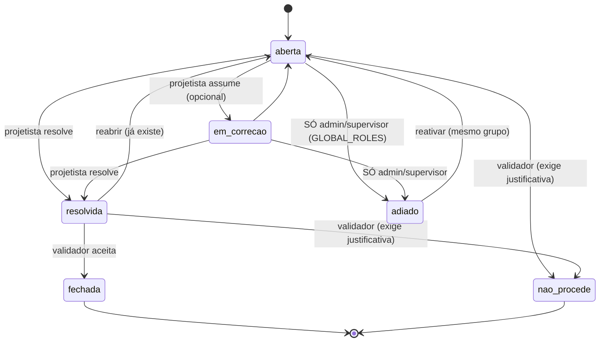
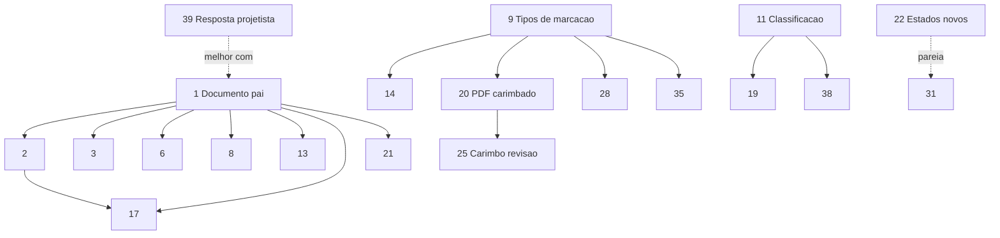

# Análise de viabilidade — evolução da ferramenta de apontamentos do visualizador de PDF

Data: 2026-08-05/06. Análise técnica item a item de 38 propostas de melhoria (+ 1 item adicional, #39, confirmado nas respostas) pra ferramenta de apontamentos (pins) do visualizador de PDF, usada na aprovação de pranchas/documentos de projeto. Nenhuma implementação foi feita nesta rodada — só auditoria + análise + decisão de desenho do vínculo documento↔versão + respostas às perguntas em aberto (ver seção final).

## Resumo da auditoria (Fase 0)

### 1. Visualizador de PDF
- `src/components/projetos/pdf-viewer.tsx` (`PdfViewer`, prancha+apontamentos) + `src/components/projetos/documento-viewer.tsx` (`DocumentoViewer`, só-leitura, usado em "Recebidos"/"Geral").
- Rota: `src/app/(dashboard)/projetos/[id]/arquivos/[uploadId]/visualizar/page.tsx`.
- Lib: `pdfjs-dist` — `package.json:55` declara `^6.1.200`, instalado `6.1.200`. Sem `pdf-lib`, `pdf-parse`, OCR ou lib de diff de PDF instalada.
- Render atual: canvas puro por página, sem text layer, sem tiling.

### 2. Modelos Prisma envolvidos
```
model Pendencia {              // schema.prisma:4007
  uploadId, disciplinaId, projetoId, numero, pagina Int, x Float, y Float,
  texto, status ("aberta|resolvida|fechada|descartada"), autorId,
  tarefaId, tarefaItemId, resolvidoPorId/Em, fechadoPorId/Em, createdAt
  @@index([uploadId, numero])
}
model RevisaoDisciplina {      // schema.prisma:2215
  disciplinaId, numero (0=RV00), motivo, autorId, createdAt
  @@unique([disciplinaId, numero])
}
model ApontamentoCoordenacao { // schema.prisma:4146 — "irmã" da Pendencia, módulo Coordenação/IFC
  projetoId, disciplinaId?, uploadId (polimórfico SEM FK: raw id OU "d:<documentoVersaoId>"),
  numero, titulo, texto, guids Json (IfcGuids), camera Json, snapshotPath?,
  status (mesmo enum), prioridade?, bcfGuid? (BCF round-trip), autorId, tarefaId/tarefaItemId, ...
}
```
Sem model de resposta/comentário na Pendencia. `TarefaComentario` (schema.prisma:3700) existe só na Tarefa (pós-envio), não no apontamento individual.

### 3. Revisão/versionamento — achado decisivo
`Upload` (schema.prisma:3924) tem `versao Int`, mas **não há entidade "Documento" pai**. Nova versão é achada em runtime por igualdade de campos, não FK:
```ts
// src/app/api/uploads/route.ts:122-128 e pendencias/actions.ts:103-111
prisma.upload.findFirst({ where: { disciplinaId, pacote, nomeArquivo, versao: { gt: upload.versao } } })
```
Renomear o arquivo quebra essa cadeia. `RevisaoDisciplina` é log grosso por DISCIPLINA (RVxx), não por arquivo. `ApontamentoCoordenacao` já tentou resolver problema parecido com referência polimórfica string-tagged sem FK real (comentário do próprio schema, linha 4154, admite isso como gambiarra).

### 4. Posição do apontamento
`x Float, y Float` (0..1, normalizada, "sobrevive a zoom/DPI") + `pagina Int`. Sem âncora textual, sem flag de incerteza.

### 5. Endpoints/actions existentes
`src/modules/projetos/pendencias/actions.ts`: `criarPendencia`, `editarPendencia`, `excluirPendencia` (**hard delete**, sem soft delete/capturarAntes), `enviarApontamentos` (agrupa em Tarefa+TarefaItem), `resolverPendencia`, `reabrirPendencia`, `fecharPendencia`, `descartarPendencia`. Numeração sequencial **por uploadId**, reinicia a cada versão. Carry-over pra nova versão: não existe.

### 6. Infra reaproveitável
Socket.io (`lib/socket.ts`), notificações (`lib/notificar.ts`, categoria+opt-out — mas `enviarApontamentos` não passa `categoria`), storage (`lib/storage.ts`), fila/worker (pg-boss, `lib/jobs.ts`), Kanban/Tarefas (já integrado), permissões (matriz role/permissão, não setor/cargo dedicado), geração de PDF via puppeteer-core (~13 rotas, mas é HTML→PDF novo, não edição de PDF existente). **Sem** pipeline de transcrição de áudio (contradiz premissa inicial do pedido).

### 7. Módulos vizinhos
Coordenação/IFC tem `ApontamentoCoordenacao` + `bcf/writer.ts` (BCF 2.1, pronto e testado) — precedente direto pro item 36. Documentos (Estúdio) e Licitações sem acoplamento com apontamentos de prancha.

## Decisão de desenho — vínculo documento↔versão

Precedente já existe no schema, repetido 6x: `Documento`/`DocumentoVersao` (schema.prisma:2395/2425), `DocumentoJuridico`/`DocJuridicoVersao`, `Certidao`/`CertidaoVersao`, `DocLicitacao`/`DocLicitacaoVersao`, `Proposta`/`PropostaVersao`, `DocumentoModelo`/`DocumentoModeloVersao`, `Art`/`ArtVersao`. `Upload` foi deliberadamente deixado fora desse padrão (comentário schema:2364-2366: "repositório geral, separado dos pacotes A/B de Upload") — não é exceção arquitetural, é escopo histórico.

Contagem real (dev DB, leitura só, sem `migrate`/`db push`):
```
uploads não-excluídos: 110
grupos (chave disciplinaId+pacote/pastaId+nomeArquivo): 104
maior cadeia de versão: 6
linhas em cadeias com >1 versão: 8
pendencias total: 6, em 3 uploads distintos, 0 delas numa versão >1
```
Cadeias reais são raras e curtas (dev DB — checar snapshot de prod antes do backfill real, `scripts/inspecionar-snapshot.ts`).

**Decidido: Opção A** — model novo `DocumentoDisciplina` (chave = disciplinaId+pacote/pastaId+nomeArquivo, materializada em vez de recalculada) + `Upload.documentoId` FK + `Pendencia.documentoId`/`uploadOrigemId`/`uploadVerificacaoId`. Segue o padrão já usado 6x no schema. Backfill: script agrupando pela chave atual, 1 parent por grupo, baixo risco dado o volume. Alternativa descartada (B — `Pendencia.documentoChave` denormalizada sem tabela pai): mais barata agora, mas repete a fragilidade que o próprio `ApontamentoCoordenacao` já documentou como gambiarra.

Todos os itens 1-8 (e vários derivados) carregam essa decisão como premissa comum.

---

## Fichas item a item (Fase 1)

**Regra de modelo aplicada sem exceção:** Schema=Sim → Modelo=Opus, independente do esforço estimado (regra do solicitante).

### Revisões e continuidade

**1. Apontamento no documento, não arquivo, c/ revisão origem+verificação**
> ✅ **IMPLEMENTADO em 2026-08-06 (Fase A).** Migration `20260806120000_documento_disciplina`
> (DDL + backfill em SQL, aplicada via `migrate deploy`). Novo model `DocumentoDisciplina`
> (`chave` normalizada + `@@unique([disciplinaId, chave])`), `Upload.documentoId`,
> `Pendencia.documentoId` + `uploadVerificacaoId`. Helper puro `modules/uploads/documento.ts`
> (`chaveDocumento`, testado) casa exatamente com a expressão do backfill — verificado contra
> os 110 uploads reais, 0 divergências. Write path (`persistir` em `api/uploads/route.ts`) faz
> upsert do pai; `renomearUpload` atualiza nome+chave do pai e passou a escopar por
> `documentoId`; `criarPendencia` numera por documento; `fecharPendencia` grava
> `uploadVerificacaoId`. Backfill dev: 104 pais / 110 uploads, 0 órfãos.
> **Efeito colateral deliberado:** o item 21 (numeração por documento) saiu junto — deixar a
> numeração por upload criaria dois "#1" dentro do mesmo documento a partir da 1ª revisão nova.
> **Pendente:** rodar o mesmo backfill contra prod (contagem foi medida só no dev) e smoke em
> navegador (upload de nova versão + renomear + apontar).

Status: NÃO EXISTE (`Pendencia.uploadId` → Upload solto, schema:4009). Falta: tudo (model+FK+campos+reescrever queries). Impacto: ALTO. Esforço: G. Complexidade: alta (toca Upload, usado por DWG/IFC/aceite/lixeira/zip). Schema: Sim — novo model + FK em Upload + campos novos em Pendencia; migration não-destrutiva com backfill. Depende: — (é a base; 2,3,6,8,13,17,21 dependem dele). Risco: alto (17 arquivos fazem match por nome hoje, todos migram). Incerteza: nenhuma bloqueante — design já assentado nesta análise. **Modelo: Opus.**

**2. Carry-over automático pra nova revisão**
> ✅ **IMPLEMENTADO em 2026-08-06 (Fase B).** Confirmou-se a previsão do R1: **nenhuma linha
> é duplicada** e não houve migration — carry-over virou troca de ESCOPO de leitura, de
> `uploadId` para `documentoId`. Esforço caiu de M para P.
> `pendenciasDoUpload` (queries.ts) passou a ler por documento e devolve `versaoOrigem` +
> `deOutraRevisao`; `enviarApontamentos` também escopa por documento (senão o apontamento
> herdado apareceria no viewer mas seria impossível de acionar); o viewer marca o pino
> herdado (opacidade + título) e mostra a revisão de origem no painel.
> A versão de origem vem por relação ANINHADA de propósito — leitura aninhada não passa pela
> extensão de soft delete, então origem na lixeira continua sendo história válida.
> Provado em transação com rollback: abrindo a v2, escopo antigo devolvia 0 apontamentos,
> novo devolve 1 com `origem=v1, deOutraRevisao=true`; banco intacto depois (6→6 / 110→110).
> **Consequência esperada:** validar a v2 agora é bloqueado enquanto houver apontamento aberto
> vindo da v1 — é o objetivo do carry-over, mas é mudança de comportamento visível.
> **Ressalva:** o pino herdado é desenhado no (x,y) original; se o layout da página mudou entre
> revisões ele fica fora de lugar. Sinalizado na UI, resolvido de fato pelo item 3.

Status: NÃO EXISTE (`persistir()` em `api/uploads/route.ts:111-168` não toca Pendencia). **Decidido (R1): mantém o MESMO número através das revisões** — simplifica o desenho: uma pendência "aberta" ancorada em `documentoId` (item 1) já é válida pra qualquer versão vigente por definição, então "carry-over" pode não precisar duplicar linha nenhuma — só resolver leituras/UI por `documentoId` + versão atual, carimbando `uploadVerificacaoId` só no fechamento. Impacto: ALTO (ataca a dor principal). Esforço: M (dado 1 pronto, senão G). Complexidade: média. Schema: Sim. Depende: 1. Risco: baixo se 1 certo. **Modelo: Opus.**

**3. Ancoragem resiliente (âncora textual + flag incerteza)**
> 📊 **MEDIDO em 2026-08-06** (o R2 respondeu "provável ter texto perto do pino"; isto é a
> medição real, nos 39 PDFs do banco de dev, via `getTextContent` + `getOperatorList`):
> - **32/39 (82%) têm camada de texto** — mediana 3597 chars/arquivo. Âncora textual é
>   viável como estratégia primária. R2 se confirma.
> - **4** têm 0 imagens e 6.585–13.172 vetores → o CAD exportou **texto como curva**.
>   Não são escaneados; não existe texto a recuperar nem com OCR sem rasterizar antes.
> - **2** têm imagem e 0 vetores → escaneados de verdade (território de OCR, fora de escopo).
> - **1** (`Detalhamento-Res-AndréFrançaR01-Pasta3-2212289.pdf`) devolve `Invalid PDF
>   structure` — **arquivo corrompido já no acervo**, hoje invisível no viewer. Bug próprio,
>   não relacionado ao item 3.
>
> **Conclusão:** o desenho da ficha já estava certo — âncora textual como primária + a flag
> "posição incerta" cobrindo os ~18% sem texto. Nenhuma decisão de produto ficou bloqueada.
> **Dependência descoberta:** item 3 precisa da EXTRAÇÃO de texto no viewer, que é exatamente
> a infraestrutura do item 26 (busca textual). O 26 deve vir antes, não depois.

> ✅ **IMPLEMENTADO em 2026-08-06 (fecha a Fase B).** Migration
> `20260806160000_pendencia_ancora_textual` — 4 colunas NULLABLE em `Pendencia`
> (`ancoraTexto`, `ancoraOffset`, `ancoraDx`, `ancoraDy`), sem backfill: linha antiga fica
> com NULL e se comporta exatamente como antes. Motor puro em
> `modules/projetos/pendencias/ancora.ts` (`construirAncora`/`relocalizarAncora`, 16 testes),
> reusando a normalização e a convenção de concatenação do `lib/pdf-busca.ts` — a âncora é,
> por construção, um substring localizável pela mesma máquina de busca do item 26.
>
> **Correção ao desenho da ficha: `posicaoIncerta` NÃO virou coluna.** A incerteza é *por
> versão* — o mesmo pino é exato na revisão em que nasceu e pode ser incerto na seguinte —,
> então uma coluna só estaria certa para uma versão e errada para todas as outras. É derivada
> na leitura, no cliente (único lugar que tem o PDF da revisão atual renderizado). O que a
> coluna pretendia registrar ("não deu para ancorar") já está codificado em
> `ancoraTexto IS NULL`.
>
> **Medição que decidiu o desenho** (1152 pontos de amostra sobre os 32 PDFs com texto): com
> raio 0.06 e trecho mínimo de 40 chars, **71% dos cliques capturam âncora e 80% dessas são
> únicas na página** → ~57% ficam relocalizáveis com confiança, o resto cai na flag. Isso é o
> que justificou guardar `dx/dy` em vez de só marcar incerteza. A primeira versão da medição
> estava furada (concatenei em ordem espacial, o texto está em ordem de documento — a âncora
> não se achava nem na própria página); o número acima é o da versão corrigida.
> **Ressalva:** esses 71% foram medidos com distância até a ORIGEM do item, antes da correção
> de segmento descrita abaixo. A taxa real de captura é maior que isso e não foi remedida — o
> número está aqui como piso, não como valor corrente. A conclusão (o desenho se paga) só
> fica mais forte.
>
> **Bug real encontrado pelo smoke, não pelos testes:** a posição de um item de texto é a
> ORIGEM dele, não o centro. Um clique no meio de um rótulo longo (`VIGA V12 SECAO 20x50
> CONCRETO...`) fica a meia largura da origem e escapava do raio — justo o rótulo mais
> informativo era o que deixava de ancorar. Corrigido para distância até o SEGMENTO ocupado
> pelo texto (`largura` normalizada passou a viajar junto no `ItemPagina`).
>
> **Verificado em navegador com duas revisões de verdade:** geradas duas versões do mesmo PDF
> (puppeteer-core) com o bloco `VIGA V12…` em y≈0.191 na R01 e y≈0.563 na R02; pino cravado ao
> lado dele na R01 pela UI; R02 enviada pela rota multipart real (virou versão 2 do mesmo
> `DocumentoDisciplina`). Resultado: âncora gravada
> (`"viga v12 secao 20x50 concreto fck 25 mpa armadura dupla"`, offset 0, dx 0.224, dy 0.014),
> e ao abrir a R02 o pino **desceu 0.371** (esperado 0.372), sem flag de incerteza, com o
> tooltip "posição reconferida pelo texto desta revisão" e o badge `R01` sem o sufixo "?".
> 0 erros de console. `npm test` 1616, lint e typecheck limpos.
>
> Limitações assumidas e documentadas no cabeçalho do módulo: `dx/dy` é normalizado à página,
> logo não sobrevive a mudança de ESCALA do desenho entre revisões; a busca é na MESMA página
> (conteúdo que mudou de página não é seguido); prancha sem camada de texto nunca gera âncora
> e o pino herdado sempre aparece como incerto.

Status: PARCIAL — já tem coordenada normalizada 0..1 (schema:4016, "sobrevive a zoom/DPI"), falta âncora textual+flag. Impacto: ALTO (sem isso, pin flutua entre revisões de layout diferente). Esforço: G. Complexidade: alta (heurística, não CRUD). Schema: Sim (campos textoAncora/offsetAncora/posicaoIncerta). Depende: 1 (+ reaproveita extração de texto já resolvida na análise da feature de busca textual, sessão paralela). Risco: médio (heurística ruidosa). Incerteza (pergunta 2): pranchas CAD/DWG→PDF costumam ser vetor sem texto perto do pin — âncora textual é plausível pro tipo real de conteúdo, ou serve mais a documentos textuais (memoriais)? **Modelo: Opus.**

**4. Modo lado a lado c/ zoom/scroll sincronizado**
Status: NÃO EXISTE (1 doc pdf.js por vez, `pdf-viewer.tsx:77`). Impacto: MÉDIO. Esforço: M. Complexidade: média (composição+sync de estado, não é lógica de negócio nova). Schema: Não. Depende: nenhuma estrutural (melhor com 1, pra escolher direto as versões do mesmo documento). Risco: baixo. **Modelo: Sonnet.**

**5. Modo sobreposição c/ cores/opacidade**
Status: NÃO EXISTE. Impacto: MÉDIO (só funciona bem se as 2 revisões tiverem mesmo enquadramento/escala). Esforço: M. Complexidade: média (canvas compositing conhecido — `drawImage` com `globalAlpha`; alinhamento entre revisões de escala diferente é frágil, mesma limitação do item 3). Schema: Não. Depende: melhor com 1. Risco: baixo técnico / médio UX (sobreposição errada confunde mais que ajuda). **Modelo: Sonnet.**

> ✅ **IMPLEMENTADO em 2026-08-06 (4 e 5 juntos — mesma tela, dois modos).** Rota própria
> `/projetos/[id]/arquivos/[uploadId]/comparar`, não dialog dentro do `PdfViewer`: um dialog
> ali significaria 3 documentos pdf.js abertos ao mesmo tempo (viewer + A + B) na página mais
> pesada do sistema. Link "Comparar revisões" no cabeçalho do viewer só aparece quando existe
> de fato outra versão. `revisoesDoDocumento` (nova, `modules/uploads/queries.ts`) é leitura
> ANINHADA de propósito — escapa do filtro de soft-delete (só intercepta `prisma.upload.*`
> top-level) porque uma revisão jogada na lixeira continua sendo uma comparação válida
> ("o que mudou desde a versão descartada"); aparece no seletor marcada "(excluída)", não
> escondida.
>
> **Lado a lado (item 4):** reusa `PdfPagina` puro (sem busca/marcas — já eram props
> opcionais, zero mudança no componente compartilhado), duas colunas, zoom e página
> compartilhados entre A e B (a "sincronização" pedida pela ficha) — mais simples e mais
> robusto que espelhar posição de scroll pixel a pixel entre dois `overflow-auto`
> independentes, que era o risco técnico real do item.
>
> **Sobreposição (item 5) — a ficha avisava "sobreposição errada confunde mais que ajuda", e
> valia a pena testar antes de construir os controles.** Não reusa `PdfPagina` (não expõe
> pixels); componente novo lê o canvas renderizado de volta e tinge cada pixel por
> interpolação linear entre BRANCO (fundo) e a cor do lado — preto vira a cor cheia, branco
> continua branco — depois empilha A (vermelho) sob B (azul, opacidade ajustável) com
> `mix-blend-mode: multiply`: tinta que só existe num lado aparece na cor dele, tinta que
> existe nos dois cai num tom escuro neutro. É a mesma convenção "revision cloud" do CAD.
> Testado com uma planta sintética (grade de paredes fixas + 1 pilar deslocado entre
> versões): o resultado é **legível, não "mingau cinza"** — pilar vermelho e azul aparecem em
> células vizinhas, nitidamente distintos; paredes que não mudaram ficam num tom uniforme que
> não compete visualmente com a mudança real. Slider de opacidade testado no extremo (0 =
> só A, vermelho puro) — confere.
>
> Verificado em navegador ponta a ponta: 2 revisões reais enviadas pela rota multipart
> (viraram v1/v2 do mesmo documento), link do viewer abre o comparador, modo lado a lado
> mostra as duas pranchas corretas lado a lado com rótulo de revisão, troca de aba pra
> sobreposição funciona, slider de opacidade funciona. 0 erros de console.

**6. Diff automático de páginas alteradas entre revisões**
Status: NÃO EXISTE, nenhuma lib de diff instalada. Impacto: ALTO (ataca a dor principal direto). Esforço: G. Complexidade: alta — diff de imagem correto (resistente a antialiasing/DPI) é não-trivial; nenhuma lib no projeto faz isso hoje. Schema: Não (pode cachear hash por página, schema leve opcional). Depende: 1 (precisa saber quais uploads são "a mesma página X" de revisões diferentes). Risco: médio (falso +/- mina confiança). Incerteza: **não confirmo** viabilidade robusta só com pdf.js — rasterizar via canvas é possível, mas comparar pixels de forma resistente a pequenas diferenças de render é escolha de algoritmo não validada; precisaria prototipar antes de estimar com confiança. Pergunta (3): aceitam "página mudou sim/não" (hash, mais simples) como v1, ou precisam de diff visual apontando a região? **Modelo: Opus** (algoritmo não-trivial, mesmo sem schema obrigatório).

> ✅ **IMPLEMENTADO em 2026-08-07.** A ficha exigia protótipo antes de comprometer — o protótipo
> foi feito e **derrubou a incerteza principal**. A dúvida era "comparar pixel é resistente o
> bastante?"; a medição respondeu: renderizar a MESMA página duas vezes pelo pdf.js dá **zero**
> pixel diferente. A rasterização é determinística, então **não há piso de ruído a descontar** —
> era isso que tornava a viabilidade duvidosa, e não existe.
>
> Números do protótipo (largura 1200 px): página idêntica → 0 pixels / 0 regiões; revisão real
> (pilar reposicionado) → 3 regiões, 0,32% da área; custo ~250 ms de render + ~12-30 ms de
> comparação por página.
>
> **Pixel, não conteúdo do PDF, e o motivo importa:** exportador de CAD reescreve o stream
> inteiro a cada gravação (IDs de objeto, compressão), então hash de conteúdo acusaria mudança
> em páginas visualmente idênticas — falso positivo em massa, que é justamente o que "mina a
> confiança" citado no risco da ficha.
>
> Motor puro em `pendencias/diff.ts` (+21 testes, sem canvas): `compararTiles` (grade de
> ladrilhos 16 px, tolerância 12/canal), `agruparRegioes` (8-conectado, varredura ITERATIVA —
> recursão estouraria a pilha numa região grande de A1) e `resumirDiff`. Roda **inteiro no
> cliente**, na terceira aba do comparador de revisões (itens 4/5), que já carregava as duas
> revisões: o servidor não tem rasterizador (o `pdf-lib` do carimbo edita PDF, não desenha; o
> `puppeteer-core` gera PDF de HTML).
>
> **Sem migração e sem persistência** — é o primeiro item desta leva que não toca o schema. O
> cálculo é barato e um resultado gravado precisaria ser invalidado a cada envio novo.
>
> Casos tratados: página só em uma das revisões (nova/removida), proporção de folha diferente
> entre revisões (formato ou `/Rotate` mudou → "não comparáveis", em vez de um diff inteiro
> falso), e **página muito alterada** → vira resumo "mudou X% da área" com as maiores regiões,
> em vez de rabiscar dezenas de caixas. A metade "a página mudou sim/não" que R3 pediu sai de
> graça: zero região = igual.
>
> **Limite honesto, e ele vai aparecer na prática:** isto detecta diferença de PIXEL, não de
> semântica. Conteúdo deslocado acusa "tudo mudou", e a região vira a união da posição velha com
> a nova — medido no protótipo com o par de layout deslocado do item 3: duas bandas de 896 px de
> largura, quase a folha inteira. É o caso que o item 3 existe pra tratar, então vai acontecer em
> revisão real. O modo "muito alterada" existe pra isso não virar ruído visual.
>
> Verificado em navegador com duas revisões reais do mesmo documento: a aba "Diferenças" marcou
> **3 regiões — 1,01% da área** (onde o pilar entrou, de onde saiu, e o texto da legenda que
> mudou), zero erro de console. Ajuste feito na verificação: o destaque saía sobre a revisão
> ANTIGA; passou a sair sobre a **A** (a que o usuário abriu pra revisar), porque a pergunta é
> "o que mudou na que estou conferindo", não "o que havia lá".
>
> **Modo CORTINA acrescentado em 2026-08-07, a pedido do solicitante** (4ª aba do comparador).
> As duas revisões ocupam exatamente o mesmo espaço e uma barra arrastável decide até onde se
> enxerga cada uma — arrastando, o desenho "vira" de uma revisão pra outra no lugar. É o modo
> que responde "o que mudou AQUI" sem tirar os olhos do ponto: o lado-a-lado obriga a alternar
> o olhar e a sobreposição mistura os dois traços. A barra alterna entre **vertical**
> (esquerda/direita) e **horizontal** (cima/baixo), como pedido — prancha deitada se compara
> melhor com corte vertical; carimbo/legenda no rodapé, com corte horizontal.
>
> O recorte é `clip-path` sobre o canvas de cima: **nada é redesenhado ao arrastar**, só muda a
> área visível — é o que mantém o arrasto fluido numa A1. Clicar em qualquer ponto joga a barra
> pra lá e já engata o arrasto (não obriga a acertar a linha de 2 px), e a alça é operável por
> teclado (`role="separator"` com `aria-valuenow`; setas movem, Shift+seta anda mais rápido,
> Home/End vão às pontas).
>
> **Bug achado na verificação, e a causa é sutil:** o `setDim` que fixa o tamanho da caixa vinha
> DEPOIS de rasterizar os dois canvases. Como os canvases são `absolute`, enquanto a
> rasterização não terminava o container ficava com **altura 0** — e o `ResizeObserver` do
> comparador remedia a largura a cada mudança de layout, cancelando o efeito antes de chegar no
> `setDim`. Resultado: altura zero permanente. O corte VERTICAL não quebrava (a largura vinha do
> elemento pai, só ficava imprecisa), mas o HORIZONTAL dividia por zero e a barra nunca saía do
> lugar. Passou a fixar o tamanho ANTES de rasterizar — a mesma ordem que o `PaginaSobreposta`
> já usava, e é por isso que a sobreposição nunca teve o problema.
>
> Verificado em navegador: arrastar leva a barra a 25%, setas movem de 2 em 2, End vai a 100%,
> alternar pra horizontal muda o `aria-orientation` e clicar a 35% da altura posiciona em 35%.
> Zero erro de console.
>
> Ficou de fora: vincular região alterada a apontamento e pré-cálculo no servidor.

**7. Evidência antes/depois no fechamento do apontamento**
Status: NÃO EXISTE (sem campo de anexo em Pendencia). `fecharPendencia` (`actions.ts:315-332`) só muda status. Impacto: MÉDIO-ALTO. Esforço: M. Complexidade: baixa/média — CRUD+upload sobre padrão já existente (`lib/storage.ts`, mesmo molde de `api/rh/funcionarios/documentos`). Schema: Sim. Depende: nenhuma estrutural forte, mais rico com 1. Risco: baixo. Incerteza (pergunta 4): histórico completo versionado, ou só snapshot mais recente de cada lado? **Modelo: Opus.**

> ✅ **IMPLEMENTADO em 2026-08-08.** Migration `20260808060000_pendencia_anexo_momento`, aditiva:
> uma coluna `momento` (`antes` | `depois`, nullable) em `PendenciaAnexo` — **não** uma tabela nova.
>
> É a resposta direta a R4 (**histórico completo versionado**, não o último snapshot de cada
> lado): com N linhas por momento ordenadas por `createdAt`, o histórico sai de graça. Uma tabela
> `PendenciaEvidencia` com dois campos de arquivo guardaria só o último e duplicaria upload,
> download, hash, permissão e remoção — tudo isso já existe e é exercitado desde o item 12.
> Anexo sem momento continua sendo anexo comum: nem toda evidência é "antes" ou "depois" (uma
> norma, um print de referência).
>
> Mesmo endpoint multipart (`/api/pendencias/anexo`), que passou a aceitar um campo `momento`
> opcional e validá-lo contra a lista fechada. Na tela, dois botões ("antes"/"depois") ao lado de
> "anexar": a escolha acontece no mesmo gesto de escolher o arquivo. O momento escolhido vive num
> `ref`, não em state — o `change` do input dispara fora do ciclo de render que o clique iniciou,
> e um state agendado ainda não teria chegado.
>
> **Não bloqueia o fechamento.** Quando alguém marca como `resolvida` sem nenhuma evidência do
> "depois", o painel avisa em texto — mas fechar continua permitido: há correção que não rende
> foto (uma cota que passou a existir na revisão nova), e travar o fluxo por isso pararia o
> trabalho pra provar o que a própria revisão já prova.
>
> Verificado em navegador: os botões "antes"/"depois" aparecem na caixa de anexos do apontamento.

**8. Painel "o que mudou desde sua última análise"**
Status: NÃO EXISTE (nenhum campo de "última visualização por usuário"). Impacto: MÉDIO. Esforço: M. Complexidade: média. Schema: Sim (tabela nova de "visto por", sem backfill — nasce vazia). Depende: 1 (documento é a unidade que faz sentido rastrear, não upload solto). Risco: baixo. Incerteza: "mudou" = só pendência nova, ou também revisão nova sem pendência nova? **Modelo: Opus.**

> ✅ **IMPLEMENTADO em 2026-08-08.** Migration `20260808070000_leitura_documento`, tabela nova
> (nasce vazia, sem backfill). `LeituraDocumento` = uma linha por (documento, pessoa) com a
> marca d'água `lidoEm`, atualizada quando ela ABRE a prancha.
>
> **Resposta à incerteza: os DOIS sinais, sempre separados.** "Mudou" é apontamento novo *e*
> revisão nova, e a frase nomeia cada um: *"Desde sua última visita: 1 revisão nova e 2
> apontamentos novos."* Somar num total ("3 novidades") faria a pessoa procurar 3 pinos e achar
> 2 — são coisas de natureza diferente pra quem abre a prancha.
>
> **Ausência de linha ≠ "tudo é novo".** Quem nunca abriu não recebe aviso nenhum: numa prancha
> com 40 apontamentos históricos, anunciar "40 novidades" pra quem chegou agora é ruído, não
> informação. Primeira visita não tem novidade — tem a prancha inteira.
>
> **A ordem é o que faz o aviso existir:** o RSC lê as novidades com a marca d'água ANTERIOR e
> passa a frase pro viewer; `marcarDocumentoLido` só roda depois de o viewer montar. Gravar
> durante a renderização faria a própria visita zerar o aviso antes de alguém lê-lo.
>
> Recortes do contador: apontamento entra por `publicadoEm` (rascunho de terceiro não é novidade
> de ninguém, item 31) e o próprio autor não conta como novidade pra si mesmo. `audit: false` na
> action — abrir prancha é navegação, e uma linha por abertura afogaria o log (o acesso ao
> arquivo já é auditado no download). A unidade é o documento, não o upload: rastrear por versão
> perderia justamente o sinal "revisão nova". Módulo puro `novidades.ts` (5 testes).
>
> Verificado em navegador, com dois usuários e três visitas: 1ª visita do Bruno sem aviso (a marca
> d'água nasce ali), publicação de um apontamento pela Helena, 2ª visita mostrando
> *"Desde sua última visita: 1 apontamento novo."* (sem contar o rascunho nem os antigos), 3ª
> visita já sem aviso.
>
> Pegadinha do smoke, não do código, que vale registrar: `now()` do Postgres devolve hora LOCAL
> (UTC-3) numa coluna `timestamp without time zone`, enquanto o Prisma grava UTC — publicar por
> SQL cru com `now()` nasce 3h no passado e o contador ignora. Nos scripts, `now() at time zone 'utc'`.

### Indicação do problema

**9. Marcações além do pin: retângulo, nuvem, seta, destaque de texto, medição**
Status: NÃO EXISTE (só x,y ponto, schema:4016-4017). Impacto: MÉDIO. Esforço: G (5 tipos) / M (1 tipo isolado). Complexidade: alta — editor de desenho vetorial sobre canvas é feature de UI não-trivial (desenhar/editar/redimensionar, touch/mouse, undo). Schema: Sim (tipo+geometria Json). Depende: —. Risco: médio (superfície grande de bugs de UX). **Modelo: Opus** pra fundação do schema; Sonnet por tipo de forma adicional depois.

> ✅ **IMPLEMENTADO em 2026-08-07 (Fase D) — fundação + 3 formas.** Migration
> `20260807030000_pendencia_marcacao_vetorial`: `marcacaoTipo` + `marcacaoGeo` (Json), ambos
> nullable e sem backfill — linha existente é pino simples, que segue sendo o comportamento
> padrão. Entregues `retangulo`, `seta` e `nuvem` (de revisão). `medida` fica com o item 28
> (precisa da escala calibrada) e `destaque de texto` com a camada de texto — os dois são as
> "formas adicionais" que a própria ficha classificou como Sonnet.
>
> **A decisão que sustenta o resto: `x`/`y` continuam sendo a âncora canônica, e a geometria é
> aditiva, guardada como OFFSETS a partir dela** (`{pontos:[{dx,dy}]}`), nunca em coordenada
> absoluta de página. Nada do que já existia mudou — pino, numeração, deep-link, âncora textual
> e replicação seguem lendo x/y. E o offset é o que faz a forma acompanhar **de graça** a
> relocalização do item 3: `pinsPosicionados` reescreve só x/y, então com coordenada absoluta o
> pino iria pro lugar certo na revisão nova e o retângulo ficaria onde a revisão ANTIGA o
> deixou — errado em silêncio, e só numa prancha de layout deslocado, que é exatamente o caso
> que o item 3 existe pra tratar. Mesmo princípio de `ancoraDx`/`ancoraDy`.
>
> Motor puro em `pendencias/marcacao.ts` (+26 testes, molde de `ancora.ts`/`lib/dxf.ts`):
> `construirMarcacao`, `caixaMarcacao`, `abasSeta` e `caminhoNuvem` — este último é a parte que
> justifica o Opus: percorre o retângulo em sentido horário e emite um semicírculo por segmento;
> como o eixo Y do SVG cresce pra baixo, `sweep-flag=1` estufa pra fora nos quatro lados sem
> caso especial, e cada lado fecha num número INTEIRO de arcos pra os cantos caírem em fim de
> arco (passo contínuo pelo perímetro deixaria bicos tortos nos cantos). `lerMarcacao` degrada
> pra pino em tipo desconhecido, geometria corrompida ou contagem de pontos inesperada, em vez
> de desenhar lixo.
>
> No cliente: `PdfPagina` ganhou a forma de FUNÇÃO no `children`, recebendo o tamanho real da
> página em px — um overlay SVG precisa disso pro `viewBox`, e um viewBox unitário com
> `preserveAspectRatio="none"` distorceria espessura de traço e curvatura de arco de jeito
> não-uniforme. O desenho é por arrasto (pointer events), com prévia ao vivo; **cancelar na
> janela é o desfazer** — não há alça de redimensionar nem arrastar forma já criada, que é a
> parte de UX onde mora o grosso dos bugs e é o próximo passo (Sonnet). Arrasto curto demais
> degrada pra pino em vez de recusar em silêncio.
>
> Réplica (item 30) copia a forma junto — mesmo problema em outra prancha, mesma razão de x/y
> já serem copiados; a âncora textual continua NÃO sendo copiada. **Degradação conhecida:** a
> âncora é construída a partir do ponto onde o arrasto começou, que num retângulo grande pode
> cair em área vazia — marcação de área fica sem âncora com mais frequência que um pino
> (confirmado no teste: a nuvem desenhada sobre região sem texto nasceu sem âncora e, na
> revisão seguinte, corretamente apareceu como "posição pode ter mudado").
>
> Verificado em navegador com o par de PDFs de layout deslocado do item 3. **O teste que
> discrimina, medido numericamente:** na v2, o pino #1 (retângulo) e o #2 (seta) foram
> relocalizados de y=0,20/0,25 para 0,5715/0,6215 — e a forma andou exatamente o mesmo
> `Δy = 0,3715`, com largura e altura preservadas. A nuvem, sem âncora, ficou parada junto com
> seu pino. Também conferido: cancelar não cria pendência, clique curto com ferramenta de forma
> grava `marcacaoTipo` nulo, e as três formas saem corretas no PDF carimbado (item 20) — o
> mesmo `caminhoNuvem` alimenta o SVG da tela e o `drawSvgPath` do PDF, então o impresso é
> geometricamente o que estava na tela. Também executado (não só compilado): editar o TEXTO de
> um apontamento com retângulo preserva `marcacaoTipo`/`marcacaoGeo` no banco e o desenho na
> tela — `editarSchema` não tem campo de marcação, então o `update` omite as colunas e o Prisma
> as deixa intactas; e o comparador de revisões (que usa `PdfPagina` sem `children`, mesma via
> do `DocumentoViewer`) segue renderizando as três páginas com zero erro de console depois de o
> `children` virar união com função.

> ✅ **FUNDAÇÃO IMPLEMENTADA em 2026-08-07 (Fase D).** Migration
> `20260807030000_pendencia_marcacao_vetorial`: `marcacaoTipo` + `marcacaoGeo` (Json), ambas
> nullable e sem backfill — linha existente segue sendo pino, o comportamento de sempre.
> Motor puro em `pendencias/marcacao.ts` (+26 testes), no mesmo molde de `ancora.ts`/`lib/dxf.ts`.
> Entregues 3 formas além do pino: **retângulo, seta e nuvem de revisão**. Faltam do enunciado
> original: destaque de texto (precisa casar com a `TextLayer`) e medição — esta última é o
> item 28, que tem calibração de escala própria. Ambas são **Sonnet**, como a ficha previu.
>
> **Decisão de dados que sustenta o resto (e o erro que ela evita).** `x`/`y` continuam sendo a
> âncora canônica (o ponto onde o arrasto começou); nada que já existia mudou — pino, numeração,
> deep-link, âncora textual e replicação seguem lendo x/y. A geometria vem por cima em
> **offsets relativos a (x,y)**, nunca em coordenada absoluta de página. Com coordenada
> absoluta, um apontamento herdado e relocalizado pela âncora textual (item 3) teria o PINO
> reposicionado no texto certo da revisão nova e o RETÂNGULO parado onde a revisão antiga o
> deixou — errado em silêncio, e só numa revisão de layout deslocado. Com offset, a forma
> acompanha sem uma linha de código a mais em `pinsPosicionados`. Mesmo princípio dos
> `ancoraDx`/`ancoraDy` já existentes.
>
> **Escopo desta rodada, de propósito:** desenhar → janela → salvar, e **Cancelar é o desfazer**.
> Sem alça de redimensionar nem arrastar forma já criada — é aí que mora a superfície de bug de
> UX que a ficha aponta, e é trabalho de Sonnet depois. Arrasto curto demais (< 0,5% da página)
> degrada pra pino em vez de recusar: quem só clicou com o retângulo selecionado ainda cria o
> apontamento.
>
> Detalhes que não são óbvios: (a) `PdfPagina` ganhou a forma de FUNÇÃO no `children`
> (`(dim) => ReactNode`), porque um overlay SVG precisa do tamanho real em px — um viewBox
> unitário com `preserveAspectRatio="none"` distorceria espessura de traço e curvatura de arco
> de forma não-uniforme, e a nuvem sairia amassada num eixo; (b) traço em `currentColor` com a
> classe de status do pino, sem cor cravada (regra do design system); (c) `non-scaling-stroke`
> pra espessura não virar tarja em 400% de zoom; (d) a replicação (item 30) **copia a forma**
> junto com a classificação — mesmo motivo de x/y já serem copiados —, e a âncora textual
> continua não sendo copiada; (e) o algoritmo da nuvem divide **cada lado** num número inteiro
> de arcos, e não o perímetro contínuo, senão a onda cruzaria os cantos no meio de um arco e a
> nuvem sairia com bico torto.
>
> **Degradação conhecida (não é bug):** a âncora textual é capturada a partir de (x,y) = canto
> inicial do arrasto. Num retângulo grande esse canto cai mais vezes em área vazia do que o
> clique de um pino, então marcação de área tende a ficar sem âncora textual com mais
> frequência — e aí herda "posição pode ter mudado" na revisão seguinte, como qualquer pino sem
> âncora. Aconteceu no smoke: retângulo e seta pegaram âncora, a nuvem não.
>
> **Verificado em navegador** (`npm run dev`, sessão real): as 3 formas desenhadas por arrasto,
> gravadas com offset correto (retângulo dx=0,270 dy=0,140 pro arrasto 0,18→0,45 × 0,20→0,34);
> Cancelar não cria nada (3 pendências, não 4); clique curto com Retângulo ativo grava
> `marcacaoTipo: null`. **O teste que discrimina** — enviada uma v2 real do mesmo documento com
> o texto deslocado (mesmo par de PDFs usado no item 3): pino #1 relocalizado de `top: 20%` pra
> `57,1497%` e o `<rect>` foi junto (y 0,20 → 0,5715), **com o mesmo tamanho** (0,27 × 0,14);
> seta idem (0,25 → 0,6215); a nuvem, que ficou sem âncora, permaneceu em 0,3458 nas duas
> versões, como devia. Replicação verificada: a cópia nasce com a mesma geometria
> (`{dx:0.270, dy:0.140}`) e `ancoraTexto: null`. Artefatos de teste removidos.
>
> ⚠️ **Achado durante o smoke (vale pra qualquer mudança de schema daqui pra frente):** o
> processo do `next dev` carrega o client Prisma gerado como módulo do bundler — regenerar com
> `db:generate` com o servidor no ar NÃO o atualiza, e a action falha com
> "Unknown argument `marcacaoTipo`". Reiniciar o dev server faz parte da migração.

**10. Biblioteca de apontamentos-padrão por disciplina**
Status: NÃO EXISTE. Impacto: BAIXO-MÉDIO. Esforço: P. Complexidade: baixa — CRUD+autocomplete, padrão de `adicionar-do-catalogo-button.tsx` já existente. Schema: Sim (tabela pequena, sem dependência de outros dados). Depende: —. Risco: baixo. **Modelo: Opus** (regra fixa, mesmo trivial).

> ✅ **IMPLEMENTADO em 2026-08-08.** Migration `20260808040000_apontamento_padrao`, tabela nova
> (nasce vazia). `ApontamentoPadrao` guarda texto + classificação sugerida + contador de usos;
> `disciplinaId` nulo = padrão GERAL, válido em qualquer disciplina.
>
> Ao contrário do vocabulário de severidade/tipo (item 11), que vive em **código** por ser
> vocabulário fixo do escritório, este é **dado**: quem revisa cadastra e edita. Daí ser tabela.
>
> `padroesDaDisciplina()` devolve os da disciplina + os gerais, ordenados por `usos desc` — o
> autocomplete precisa colocar na frente o que a equipe de fato escreve, não o que foi
> cadastrado primeiro. Aplicar um padrão preenche texto e pré-classificação e incrementa o uso
> por uma action separada (`registrarUsoApontamentoPadrao`, `audit: false`): falhar a contagem
> não pode derrubar a criação do apontamento, que é o que importa.
>
> Só aparece no formulário de **criação** — editar um apontamento existente é ajustar o que já
> foi escrito, não escolher de catálogo. Desativação é soft (`ativo = false`): sai do
> autocomplete sem sumir de quem já usou.
>
> Verificado em navegador: "salvar como padrão" grava na disciplina certa, a caixa de busca
> aparece no formulário seguinte, aplicar preenche o texto e o contador de usos vai a 1.

**11. Classificação estruturada: disciplina, severidade, tipo**
Status: PARCIAL — disciplina já vem via FK (schema:4011); severidade/tipo não existem. Impacto: MÉDIO-ALTO (alimenta 18, 19, 38). Esforço: P. Complexidade: baixa. Schema: Sim. Depende: —. Risco: baixo. Incerteza: taxonomia de severidade/tipo é decisão de produto. **Modelo: Opus.** ✅ *quick win*

> ✅ **IMPLEMENTADO em 2026-08-06 (Fase C).** Migration
> `20260806220000_pendencia_classificacao_thread_softdelete` adiciona `Pendencia.severidade` e
> `Pendencia.tipo`, ambos **nullable e sem backfill** (não dá pra inferir severidade de texto
> livre; "não classificado" é estado legítimo, não um buraco).
>
> **Taxonomia (decisão do solicitante, 2026-08-06)** — `impeditivo` é o TOPO da escala, não um
> flag paralelo: o item 19 vai ler uma coluna só (`severidade === "impeditivo"`), sem combinar
> dois campos. Severidade: `impeditivo | alta | media | baixa`. Tipo (6):
> `incompatibilidade | falta_informacao | erro_tecnico | norma | representacao | outro`.
>
> Catálogo em **código**, em `pendencias/helpers.ts` junto do `STATUS_PENDENCIA` — não é tabela
> porque é vocabulário fixo do escritório, não dado que o usuário cadastra (isso é o item 10).
> O arquivo é client-safe (sem `server-only`), então action e componente leem a mesma lista.
> Puro e testado (+9 testes): `pesoSeveridade` (não classificado vai pro FIM, não pro topo — null
> não é "pouco grave") e `temImpeditivoAberto`, que já é a base pronta do item 19 (ainda não
> ligada a nenhum gate).
>
> Classificar é **opcional** na criação: exigir dois selects a cada pino transformaria o
> clique-e-descreve na interação mais quente do viewer num formulário. Action `classificarPendencia`
> separada do `editarPendencia` de propósito — editar texto é privilégio do autor e só enquanto
> aberto/sem tarefa (senão o item de checklist já enviado passaria a descrever outra coisa),
> enquanto reclassificar vale depois do envio, que é justamente quando a triagem acontece.
> Cópia do item 30 herda a classificação (mesmo problema em outra prancha) — ao contrário da
> âncora, que não herda.
>
> UI: badges na lista lateral (só `impeditivo` em vermelho sólido, os outros contorno, pra não
> competir com o badge de status), aviso em vermelho no formulário quando escolhe impeditivo,
> nova ordenação "Gravidade" no painel, e badge + filtro de severidade na visão consolidada
> `/pendencias` (item 16) — classificação sem a tela de triagem seria inútil.
>
> Verificado em navegador (`npm run dev`, sessão real da Helena): apontamento criado como
> `impeditivo`/`incompatibilidade` grava as duas colunas no banco, os dois badges aparecem na
> lista, o aviso de bloqueio aparece no form, "Gravidade" ordena o classificado (Média) antes
> dos não classificados, e a `/pendencias` mostra o filtro "Toda severidade" + o badge.
> **O caminho que importa também foi exercitado:** num apontamento que JÁ virou tarefa (onde o
> botão "editar" some, confirmado na tela), só "classificar" aparece — salvou `alta`/`norma`,
> e a auditoria registrou `antes.severidade: null → novo.severidade: "alta"`. Sem esse botão a
> classificação ficaria congelada exatamente na janela em que a triagem acontece.

**12. Anexos: print, foto, áudio, link**
Status: NÃO EXISTE. **Decidido (R5): sem transcrição por enquanto** — áudio entra só como anexo bruto (arquivo), sem speech-to-text. Isso remove o sub-escopo caro/incerto do item (nenhum serviço externo, nenhuma decisão de fornecedor pendente). Impacto: MÉDIO. Esforço: M (uniforme — print/foto/áudio/link são todos "upload simples", reaproveitando `lib/storage.ts`, mesmo molde de `api/rh/funcionarios/documentos`). Complexidade: baixa. Schema: Sim (tabela `PendenciaAnexo`). Depende: —. Risco: baixo. **Modelo: Opus.**

> ✅ **IMPLEMENTADO em 2026-08-07 (Fase D).** Migration `20260807100000_pendencia_anexo`: tabela
> nova, nasce vazia. Os campos de arquivo espelham `AnexoLead` de propósito (é a mesma forma que
> `salvarArquivo` devolve) — evita dois vocabulários diferentes pro mesmo conceito no schema.
> **Sem transcrição de áudio** (R5): o arquivo entra bruto.
>
> Arquivo sobe por multipart (`POST /api/pendencias/anexo`) porque foto/áudio estouram o
> `bodySizeLimit` de Server Action; **link é só texto e vai por action** (`anexarLinkPendencia`).
> Teto de 25 MB (mesmo dos documentos de RH) e lista fechada de mime: imagem, áudio e PDF —
> aceitar qualquer coisa transformaria a caixa de evidência num repositório genérico, que já é
> o papel do módulo de uploads.
>
> **Gate mais largo que o das rotas irmãs, e é intencional:** anexar usa participante do
> apontamento (autor dele, responsável da disciplina ou perfil global), não `uploads:validar`.
> O caso de uso do item é o projetista juntando foto do ajuste feito — ele é o outro lado da
> conversa, igual na thread do item 39. Extraí `exigirParticipante` e o item 39 passou a usá-lo
> também. Cliente não passa: nunca é autor (criar exige `uploads:validar`) nem responsável.
> Confirmado no navegador: Bruno (responsável, não autor) anexa → 200; sem sessão → 401.
>
> **Validação de URL não é cosmética.** O link vira `href` na tela, e `z.string().url()` sozinho
> aceita `javascript:` e `data:` — vetor de XSS. O schema exige http/https, e a âncora sai com
> `rel="noopener noreferrer"`. Verificado: `javascript:alert(1)` recusado com "O link precisa
> começar com http:// ou https://"; `https://…` aceito.
>
> **Cada tipo tem render próprio** — quatro linhas de download idênticas entregariam bem menos
> do que a ficha promete. Imagem vira miniatura clicável, áudio vira `<audio controls>` (é o que
> torna "áudio como anexo bruto" utilizável sem baixar o arquivo), PDF vira linha de download e
> link vira âncora externa. A rota GET serve **inline** para imagem/áudio por padrão (senão o
> player e o `` não funcionam) e `attachment` para o resto, com `?disposition=` para forçar
> o contrário — mesmo padrão de `/api/uploads/[id]/download`.
>
> Excluir o anexo apaga o arquivo do disco junto (verificado): anexo não tem lixeira, e deixar
> órfão só ocupa espaço. Continua valendo a nota do item 14 — apagar o `Upload` cascateia e
> hard-deleta as `Pendencia`s, aí sim deixando arquivos órfãos; não há faxineiro e não foi pedido.
>
> **Bug de UI corrigido durante a verificação:** o `<input type="file">` escondido ficava no
> mesmo galho condicional dos campos de link, então o React reaproveitava o nó DOM e alternava
> um input não-controlado com um controlado — dois avisos de "controlled/uncontrolled" no console
> e o `ref` se perdendo. Passou a ficar fora do condicional.
>
> Verificado em navegador de ponta a ponta: PNG e WAV enviados chegam ao disco com **bytes
> idênticos** aos enviados; `.exe` recusado com 400; a imagem carrega (2×2) e o player de áudio
> aparece; anexar e remover **pelos botões da UI** funcionam (4 → 5 → 4, com o arquivo saindo do
> disco); zero erro de console.

**13. Referência cruzada entre pranchas/documentos**
Status: NÃO EXISTE. Impacto: BAIXO-MÉDIO. Esforço: P/M. Complexidade: baixa. Schema: Sim. Depende: 1 (referenciar "documento", não upload solto). Risco: baixo. **Modelo: Opus.**

> ✅ **IMPLEMENTADO em 2026-08-08.** Migration `20260808050000_referencia_pendencia`, tabela nova.
> Liga pendência → pendência (não documento → documento): como a pendência já está ancorada no
> `DocumentoDisciplina` pelo item 1, a ligação sobrevive às revisões dos **dois** lados de graça.
>
> **A ligação é direcional, mas exibida nos dois lados.** Quem abre o apontamento citado precisa
> saber que alguém o citou — mostrar só o lado "aponta para" deixaria metade da informação
> invisível justamente pra quem tem que agir. `direcao` (`feita` | `recebida`) só existe pra UI
> escrever a frase certa.
>
> Quatro coisas que o banco não pega sozinho, e por isso estão no código:
> - **par inverso.** `@@unique([origemId, destinoId])` não impede `B→A` quando `A→B` existe — e,
>   com exibição bidirecional, isso renderizaria linha duplicada nos dois apontamentos. A action
>   recusa nos dois sentidos. Auto-referência idem.
> - **alvo excluído.** `Pendencia` é soft delete e fica FORA da extension de `lib/prisma.ts`,
>   então o `ON DELETE CASCADE` da FK nunca dispara em `excluirPendencia`; sem `excluidoEm: null`
>   explícito na leitura, a ligação viraria um chip pendurado no nada.
> - **revisão vigente.** O link abre `?pin=<numero>` e `numero` é escopado por documento, mas o
>   `uploadId` gravado é a versão em que o apontamento NASCEU — que pode ser obsoleta e
>   só-leitura. A leitura resolve a maior `versao` do documento (fallback pro próprio upload em
>   linha legada).
> - **rascunho de terceiro.** Referenciar o que ninguém mais enxerga (item 31) produziria um link
>   que não resolve; o seletor e a action tratam como inexistente. O lado **inverso** também: a exibição
>   bidirecional mostra a ORIGEM na tela do apontamento citado, e a origem pode ser um rascunho —
>   caminho normal do item 17, onde a reincidência confirmada liga um apontamento recém-criado
>   (ainda rascunho) ao fechado. Sem filtro na leitura, o texto da análise em andamento apareceria
>   pra qualquer um que abrisse a prancha do citado.
>
> Gate: **participante** (`baseProjetista` + `exigirParticipante`), igual a anexo (item 12) e
> resposta (item 39) — ligar dois apontamentos é acrescentar contexto a um que já existe, e o
> projetista é justamente quem costuma reconhecer que dois problemas são o mesmo. Exigir
> `uploads:validar` deixaria de fora quem tem a informação.
>
> O seletor de destino é escopado por projeto **na consulta**, a partir do `projetoId` da própria
> pendência de origem — não de um id vindo do navegador.
>
> Verificado em navegador (dois usuários): "referenciar" → busca → clique cria a ligação, os dois
> lados aparecem, a lixeira desfaz. E o teste que importa: com Helena mantendo um apontamento em
> rascunho ligado a um fechado, Bruno abriu a prancha do fechado e **não** viu nem o texto nem o
> número do rascunho.

**14. Criação por seleção de área + atalhos + thumbnail do recorte**
Status: NÃO EXISTE (criação hoje é só clique de ponto, `pdf-viewer.tsx:730-736`). Impacto: MÉDIO. Esforço: M. Complexidade: média (combina com 9 se área virar tipo de marcação). Schema: Sim, se thumbnail persiste. Depende: some bem com 9. Risco: baixo. Incerteza (pergunta 6): thumbnail precisa ficar salvo, ou é só apoio visual no momento de criar? **Modelo: Opus.**

> ✅ **IMPLEMENTADO em 2026-08-07 (Fase D).** A "seleção de área" veio junto do item 9 (arrastar
> retângulo/nuvem já É selecionar área). Restavam as duas outras partes, e as duas foram feitas:
> **miniatura persistida** (R6) e **atalhos de teclado**.
>
> Migration `20260807090000_pendencia_thumb`: `thumbPath` nullable, sem backfill. Duas rotas no
> molde exato do snapshot da Coordenação — POST `/api/pendencias/thumb` anexa (multipart, teto de
> 2 MB, só PNG, só o autor ou admin) e GET `/api/pendencias/thumb/[id]` serve com o mesmo gate de
> acesso ao projeto das rotas irmãs. Criação em DOIS passos porque `bodySizeLimit` de Server
> Action estoura com blob de imagem.
>
> **Só marcação de ÁREA gera miniatura.** O "recorte" do item 14 é a área selecionada, e pino
> simples não tem área; além disso é a interação mais quente do viewer e não deve pagar um round
> trip a mais — mesma razão de a consulta de menções (item 33) só disparar quando existe "@" no
> texto. Verificado no navegador: criar um pino não dispara requisição nenhuma pra `/thumb`.
>
> O recorte sai do canvas JÁ RENDERIZADO da página (nada de re-renderizar o PDF só pra isso),
> com folga de 25% em volta — marcação colada no desenho fica ilegível sem contexto — e é
> reduzido a no máximo 480px de largura. `caixaRecorte` é puro e testado (+5 testes): usa os
> pixels REAIS do canvas (que já incluem o DPR; o tamanho CSS daria recorte deslocado em tela
> retina) e **arredonda as bordas, não o offset e o tamanho separadamente** — o teste pegou que
> a segunda forma estoura o canvas em 1px na borda, e `drawImage` com origem fora devolve faixa
> transparente em vez de erro, ou seja, um PNG plausível e errado. Falha de upload degrada em
> silêncio: o apontamento já existe e é válido sem miniatura.
>
> Atalhos: `A` liga/desliga o modo, `1..4` escolhem pino/retângulo/seta/nuvem (e já ligam o
> modo, senão a tecla parece não fazer nada), `Esc` sai. Saem fora quando o foco está em
> `INPUT`/`TEXTAREA`/`contenteditable` ou quando qualquer janela está aberta — o viewer tem
> quatro superfícies de digitação (busca, descrição, resposta da thread e os `Select` do base-ui,
> que tratam seta/typeahead por conta própria). `Esc` só desliga o modo apontar e só com tudo
> fechado, porque o base-ui já fecha diálogo no Esc sozinho e tratar aqui também faria a tecla
> disparar duas coisas.
>
> **Bug real corrigido, achado pelo teste em navegador (regressão do item 9):** o pino simples
> era criado no `pointerdown`, então o `pointerup` seguinte caía FORA da janela recém-aberta e o
> base-ui a fechava na hora como clique-fora — a janela piscava e sumia. Passou despercebido
> antes porque `mouse.click` do Playwright dispara os dois eventos quase juntos e, dependendo do
> tempo, a janela nem tinha montado a tempo de escutar o dismiss. Agora **todo** apontamento
> nasce no `pointerup` (o pino ignora pra onde o ponteiro foi e usa o ponto onde o clique
> começou). Isolado dispatchando `pointerdown` e `pointerup` separados: com só o down a janela
> abre, com o up ela fecha.
>
> Verificado em navegador: retângulo desenhado sobre uma faixa de texto conhecida gera PNG de
> 8 KB no disco sob `STORAGE_BASE_PATH`, carregado a 480×95 pelo browser, e a imagem mostra
> **exatamente a região marcada** ("VIGA V12 SECAO 20x50 CONCRETO…"), não a página inteira nem
> em branco. Atalho `2` liga o modo e seleciona Retângulo; digitar `4` dentro do campo de busca
> **não** troca a ferramenta. Zero erro de console.
>
> **Duas notas de manutenção (não são código):** (a) apagar um `Upload` cascateia e hard-deleta
> suas `Pendencia`s, deixando os PNGs órfãos no disco — mesma forma dos snapshots da Coordenação;
> não há faxineiro e não foi pedido. (b) A miniatura é derivada: hoje não dá pra editar a
> geometria (o item 9 foi entregue de propósito sem alça de redimensionar), então ela não tem
> como ficar desatualizada; quando a continuação em Sonnet adicionar redimensionar, vai precisar
> regerar o recorte.

### Análise do gerente

**15. Lista lateral sincronizada, filtrável e ordenável**
Status: PARCIAL — sincronizada JÁ EXISTE (clique na lista rola até o pino, `pdf-viewer.tsx:530-536`). Filtro/ordenação: NÃO EXISTE (só sort fixo por número, linha 521-522). Impacto: MÉDIO. Esforço: P. Complexidade: baixa (filtro client-side sobre array já carregado). Schema: Não. Depende: —. Risco: baixo. **Modelo: Sonnet.** ✅ *quick win*

> ✅ **IMPLEMENTADO em 2026-08-06.** Dois `Select` no cabeçalho do painel: status
> (todos/aberta/resolvida/fechada/descartada) e ordenação (nº/página/mais recente) — só a
> LISTA filtra, os pinos no canvas continuam todos visíveis (filtrar a lista ≠ esconder pino
> da prancha). Verificado em navegador: filtrar por "Fechada" numa prancha com 3 pendências
> abertas e 0 fechadas zerou a lista (confirmado numericamente, contagem 42→39 no seletor
> amplo do smoke — os 3 reais somem, resto é ruído do próprio seletor de teste).

**16. Visão consolidada por projeto/disciplina/responsável, com aging**
Status: NÃO EXISTE (só `contarPendenciasAbertas`, `queries.ts:50-58`, contagem simples). `lib/aging.ts` existe mas pra financeiro — padrão reaproveitável, não dado pronto. Impacto: ALTO (núcleo da "análise do gerente"). Esforço: M. Complexidade: média (groupBy Prisma + padrão de bucket). Schema: Não. Depende: melhora muito com 1 (aging por documento, senão nova versão "reseta" idade artificialmente). Risco: baixo. **Modelo: Sonnet.**

> ✅ **IMPLEMENTADO em 2026-08-06.** Nova página `/pendencias` (nav "Apontamentos", grupo
> Gestão), gate reaproveitando `arquivos:ver` — **decidido não criar recurso de permissão
> novo** só para uma tela que agrega dado já visível projeto a projeto (evita depender de
> `db:seed` em produção pra uma feature de leitura). `visaoConsolidadaPendencias` resolve o
> escopo de acesso (`escopoProjeto`, igual ao dashboard) ANTES de buscar `Pendencia` — o
> model não tem relação Prisma pra `Projeto` (só a coluna), então não dá pra aninhar o filtro,
> resolve-se o conjunto de projetos acessíveis primeiro e filtra por `projetoId IN (...)`;
> perfil global não filtra. Aging reaproveita `calcularAging`/`FAIXA_COR`/`FAIXA_LABEL` de
> `lib/aging.ts` direto (dias desde `createdAt` da pendência, não da versão — carry-over não
> reseta a idade). Agrupa/filtra por projeto, disciplina ou responsável, client-side.
> Verificado em navegador: contador da tela bateu exatamente com a contagem real do banco (5
> apontamentos abertos, mesmo número em ambos).
>
> **Bug encontrado e corrigido de passagem** (achado pelo advisor antes de construir 37 em
> cima): `contarPendenciasAbertas` (helper pré-existente, citado nesta própria ficha) ainda
> escopava por `uploadId`, não `documentoId` — a mesma classe de bug já corrigida em outros
> pontos na Fase B, que passou batido aqui por não ter chamador nenhum no código até agora
> (função morta). Corrigido para contar por documento (com fallback por upload em linha
> legada), já que o item 37 ia herdar o bug se reaproveitasse como estava.

**17. Detecção de reincidência de apontamentos**
Status: NÃO EXISTE. Impacto: MÉDIO-ALTO. Esforço: G. Complexidade: alta (similaridade textual real é algoritmo não-trivial). Schema: provavelmente Sim (persistir vínculo de reincidência). Depende: 1, 2 (com carry-over pronto, fica quase trivial dentro da mesma cadeia). Risco: médio (falso + esconde problema novo). Incerteza (pergunta 7): "reincidência" é (a) mesma pendência reaberta (já existe hoje) ou (b) pendência nova que parece repetir uma fechada antes? Esforços bem diferentes. **Modelo: Opus.**

> ✅ **IMPLEMENTADO em 2026-08-08.** Escopo (R7): **(b)** apontamento novo que repete um já
> encerrado — o caso (a) já existe como estado (`reaberturas`, item 22) e não precisa de algoritmo.
>
> **Sem schema novo.** A ficha previa "persistir vínculo de reincidência"; o vínculo é a
> referência cruzada do item 13, criada com `nota: "reincidência"`. Uma tabela própria seria uma
> segunda ligação entre os mesmos dois apontamentos, com a mesma semântica e outra tela pra manter.
>
> Heurística **léxica**, e assim de propósito: similaridade semântica de verdade exigiria
> embeddings/IA, que o item 38 já adiou. Jaccard sobre conjunto de tokens (minúsculo, sem acento,
> sem palavra vazia, token < 3 fora) — não distância de edição: o que se repete num apontamento
> de projeto é o vocabulário ("cota ausente na planta baixa"), não a grafia, e Jaccard é
> indiferente à ordem das palavras, que muda toda hora sem mudar o problema.
>
> **Limiar 0,40, medido — não escolhido de cabeça.** O banco de dev tem 6 apontamentos e
> **nenhum par com uma palavra sequer em comum** (varredura completa: 0 pares com score > 0), ou
> seja, não oferece sinal. O corte saiu de um corpus rotulado à mão de 16 pares em pt-BR (8
> "mesmo problema reescrito" × 8 "só o vocabulário da disciplina em comum"):
>
> | limiar | acha o mesmo problema | falso positivo |
> |---|---|---|
> | 0,60 | 4/8 | 1/8 |
> | 0,50 | 7/8 | 1/8 |
> | **0,40** | **8/8** | **1/8** |
> | 0,25 | 8/8 | 3/8 |
>
> Em 0,40 os 8 legítimos aparecem e o único falso positivo é *"viga V-04 sem detalhamento de
> armadura"* × *"pilar P-07 sem detalhamento de armadura"* (0,60) — elemento diferente, mas
> literalmente o mesmo problema recorrente, que é um aviso defensável. Recalibrar quando houver
> histórico real de repetição.
>
> **Contra o risco que a própria ficha registra** (falso positivo escondendo problema novo): a
> heurística não fecha, marca nem classifica nada. É uma sugestão que aparece enquanto a pessoa
> digita, com no máximo 3 itens, e confirmar apenas registra a ligação. Só candidatos `fechada`
> entram — `descartada` é o "não procede" (item 22), e sugerir repetição do que o escritório já
> julgou improcedente empurraria pra fechar um apontamento legítimo; `resolvida` ainda está em
> verificação. Escopo é a DISCIPLINA, não o documento: "cota ausente" volta na planta do
> pavimento seguinte, e limitar ao documento perderia o caso que o item existe pra pegar.
>
> Limitação registrada em teste: código de elemento ("V-04") se decompõe em tokens curtos demais
> e não sobrevive à tokenização — o casamento vem do vocabulário do problema, não do código da peça.
>
> Verificado em navegador: com *"Cota ausente na planta baixa do pavimento terreo"* fechado numa
> prancha, digitar *"Falta cota na planta baixa do pavimento terreo"* em OUTRA prancha da mesma
> disciplina fez a caixa aparecer citando o #1; marcar e criar gravou a referência com
> `nota = "reincidência"`, e o apontamento novo continuou rascunho.

**18. Prazo/SLA por apontamento com notificação agrupada**
Status: NÃO EXISTE (só a Tarefa agrupada tem prazo, `actions.ts:207`, não a pendência individual). **Decidido (R8): prazo fixo definido na criação** (não calculado por severidade) — remove a dependência de 11. Impacto: MÉDIO. Esforço: M. Complexidade: baixa/média (infra de job pronta — pg-boss/`lib/jobs.ts` — só configurar handler; sem tabela de regra por severidade). Schema: Sim (campo prazo). Depende: — (independente de 11 agora). Risco: baixo. **Modelo: Opus.**

> ✅ **IMPLEMENTADO em 2026-08-08.** Migration `20260808030000_pendencia_prazo`, aditiva.
> Data FIXA na criação (R8), ajustável na triagem junto de severidade/tipo — sem tabela de regra
> por severidade.
>
> **O relógio corre a partir de `publicadoEm`, não de `createdAt`** — descoberta que veio do
> item 31: enquanto o apontamento é rascunho ele existe só pra quem escreveu, e cobrar prazo de
> alguém que ainda não pode ver o problema não é SLA, é armadilha. Um apontamento criado na
> segunda e entregue na quinta começa a contar na quinta.
>
> **Reativar um `adiado` PRESERVA o prazo** (decisão do solicitante em 2026-08-08, que era o
> ponto deixado em aberto pelo item 22). Sai de graça: nenhuma transição mexe em `prazo`.
> `adiado` continua no radar de prazo — adiar tira da fila de trabalho, não do relógio.
>
> Motor puro em `pendencias/prazo.ts` (+15 testes): `diasAtePrazo` compara por DIA e não por
> hora (prazo é data, não horário), `situacaoPrazo` classifica em
> sem_prazo/no_prazo/vence_em_breve/vencido e nunca marca como vencido o que já está encerrado —
> cobrar SLA de algo fechado é ruído puro.
>
> **Notificação agrupada por PESSOA, não por apontamento** (`agruparPorDestinatario`, puro e
> testado): uma prancha com 12 apontamentos vencidos viraria 12 pushes, que é a forma mais rápida
> de alguém desligar a categoria inteira. O job (`alertas-prazo-apontamento`, dias úteis 08:10)
> manda uma notificação por responsável, com as 3 primeiras e "+N", e usa tag por pessoa+dia pra
> reexecução não empilhar.
>
> Verificado **invocando o handler direto** — jobs pg-boss não rodam em `npm run dev`, então
> navegador não cobriria: rascunho com prazo vencido → 0 avisados; o mesmo apontamento publicado
> → 1 avisado, com a mensagem agrupada correta; apontamento encerrado → 0 avisados. Estado do
> banco restaurado ao fim.
>
> **Nota do desenho:** "vencido" é um RÓTULO, não um bloqueio — não entrou em `contaComoTrabalho`.
> Apontamento vencido não impede validação por si só; quem bloqueia é o impeditivo (item 19).

**19. Integração Kanban + bloqueio de aprovação por apontamento impeditivo**
Status: PARCIAL — Kanban JÁ EXISTE e é central (`enviarApontamentos` cria Tarefa+TarefaItem, `actions.ts:200-225`). "Impeditivo": NÃO EXISTE — hoje bloqueia por qualquer pendência aberta (`!temApontamentoAberto`, `pdf-viewer.tsx:95`), sem distinguir severidade. Impacto: ALTO (metade já entregue). Esforço: P. Complexidade: baixa (estender condição existente). Schema: Sim (o campo/severidade). Depende: 11. Risco: baixo (mudança pequena em condição já testada). **Modelo: Opus.**

> ✅ **IMPLEMENTADO em 2026-08-07** (depois do item 22, de propósito: `temImpeditivoAberto` lê
> "está aberta", e fazer antes significaria escrever duas vezes assim que `em_correcao` surgisse).
> `temImpeditivoAberto` — que já estava escrita e testada desde o item 11, sem chamador — passou
> a alimentar a barra do viewer: com impeditivo em aberto o aviso vira vermelho e diz
> **"Apontamento IMPEDITIVO em aberto — não é possível validar"**, em vez do genérico.
>
> A função usa `estaAberta`, não `status === "aberta"`: um impeditivo que o projetista assumiu
> (`em_correcao`) continua travando — se contasse só "aberta", assumir a correção destravaria a
> aprovação, que é o oposto do que o estado significa. Coberto por teste.
>
> O Kanban já estava entregue desde antes (`enviarApontamentos` cria Tarefa + TarefaItem, e cada
> transição sincroniza o item do checklist). Verificado em navegador com um apontamento
> impeditivo real.

**20. Exportação: PDF carimbado com marcações + relatório em lista/planilha**
Status: NÃO EXISTE export nenhum. Infra de relatório (planilha/PDF-de-HTML) JÁ EXISTE amplamente (puppeteer-core em ~13 rotas, exceljs em `eap-export`). "PDF carimbado" (desenhar marcação em cima do PDF original) é capacidade DIFERENTE — puppeteer gera PDF novo, não edita existente. Impacto: MÉDIO-ALTO. Esforço: P (só relatório) / G (carimbado). Complexidade: baixa (relatório) / alta (carimbado). Schema: Não. Depende: carimbado depende de 9. Risco: baixo/médio. Incerteza: **não confirmo** se lib de edição de PDF (ex. pdf-lib, não instalada) cobre bem overlay em PDF vetorial de CAD — não pesquisei essa lib. **Modelo: Sonnet** (relatório) / **Opus** (carimbado).

> ✅ **IMPLEMENTADO em 2026-08-07 (Fase D).** Dependência `pdf-lib@^1.17.1` instalada com
> autorização explícita do solicitante — é a única lib do projeto capaz de EDITAR um PDF
> existente (o `puppeteer-core` das outras ~13 rotas gera PDF novo a partir de HTML, o que não
> serve). Entregues as duas metades: **relatório** (planilha) e **PDF carimbado**, este último
> já com o carimbo de análise do item 25.
>
> **Spike primeiro, em PDF de CAD real do acervo** (era a incerteza declarada da ficha):
> prancha A1 de estrutural (2384×1684pt) carrega em ~2ms e desenha+salva em ~5ms, saída com o
> mesmo tamanho do original e conteúdo vetorial intacto. Censo dos 46 PDFs do storage:
> **1 página com `/Rotate 270`**, **0 com CropBox ≠ MediaBox**, **0 com origem de MediaBox
> fora de (0,0)** e **1 arquivo que nem carrega** (o mesmo `Detalhamento-Res-…-2212289.pdf` que
> já falhara no censo do item 3).
>
> **Rotação era o risco real, e é onde mora a armadilha.** O cliente grava `x`/`y` normalizados
> contra o canvas do pdf.js, que já tem `/Rotate` aplicado; o `pdf-lib` desenha no espaço de
> usuário NÃO rotacionado. `carimbo/coords.ts` (puro, +21 testes) faz a ponte. Duas coisas que
> só a medição resolveu: (a) o ângulo do texto pra sair em pé é `+rot`, **não** `-rot` —
> `/Rotate` gira horário e o `pdf-lib` anti-horário, então se cancelam com o mesmo sinal, e o
> palpite óbvio (negativo) imprime de cabeça pra baixo (conferido lado a lado numa A1
> `/Rotate 270`); (b) em 90/270 os eixos trocam, então a caixa vem de converter os DOIS cantos,
> nunca de escalar largura/altura separadamente. Como o acervo só tem amostra de 0° e 270°, os
> ramos de 90° e 180° são cobertos por uma propriedade de ida-e-volta
> (`paraVisual(paraPdf(u,v)) ≈ (u,v)`) nas quatro rotações — é ali que um W/H trocado apareceria,
> já que nenhum arquivo real revelaria. **Limite honesto dessa cobertura:** `paraVisual` é a
> inversa escrita por mim, então um erro de sinal presente nos DOIS fecharia o ciclo do mesmo
> jeito. 0° e 270° estão ancorados na realidade (cantos conferidos contra prancha de verdade);
> 90° e 180° são, hoje, só internamente consistentes — a primeira prancha `/Rotate 90` que
> aparecer é o que confirma ou derruba esses dois ramos.
>
> **As posições vêm do CLIENTE, e isso é deliberado.** O viewer relocaliza pinos herdados pela
> âncora textual (item 3) usando texto extraído pelo pdf.js — cálculo que só existe no
> navegador. Carimbar o `x`/`y` cru do banco faria a folha impressa mostrar o apontamento num
> lugar e a tela em outro: exatamente a divergência que R10 quer evitar. Por isso a rota é
> **POST** (dezenas de pinos não cabem em querystring) e o cliente manda **só a posição** —
> texto, número, status e classificação continuam vindo do banco. A rota aceita no máximo 500
> posições; acima disso os excedentes caem no `x`/`y` do banco (degradação certa, mas então o
> impresso pode divergir da tela nesses casos — nenhuma prancha do acervo chega perto).
>
> Três ajustes que só a conferência visual pegou: (a) o bloco ficava em cima do **selo do
> próprio CAD**, que mora no canto inferior direito de praticamente toda prancha — mudou pro
> inferior esquerdo; (b) pino de 9pt some numa A1 (0,4% da largura, contra 2,7% na tela) —
> todo o desenho escala pelo lado curto da folha, com piso e teto; (c) apontamento **aberto e
> impeditivo** sai em vermelho e ganha linha própria de "ATENÇÃO" no bloco, porque só
> "Liberado por Fulano" leria como liberação de uma prancha que não pode ir pro canteiro.
>
> Acentuação: as fontes padrão do PDF são WinAnsi, que cobre o português mas **lança** em
> caractere fora da tabela — nome de projeto/pessoa/arquivo passa por um sanitizador que troca
> o que não couber por "?" em vez de derrubar a exportação.
>
> **PDF corrompido tem tratamento próprio:** o arquivo do acervo que não carrega devolve 422 com
> "Este PDF não pôde ser carimbado — o arquivo está corrompido ou usa um formato não suportado",
> não um 500 mudo. Verificado contra o arquivo real.
>
> **Relatório** (`/api/pendencias/relatorio`, `exceljs`): 16 colunas com projeto, disciplina,
> prancha, nº, página, status, severidade, tipo, marcação, descrição, autor, datas, revisão de
> origem e contagem de respostas; escopo por prancha (`?upload=`) ou projeto (`?projeto=`), com
> filtro e cabeçalho congelado. Sem dependência nova e sem relação com o item 9.
>
> Verificado em navegador na prancha `/Rotate 270`: apontamentos criados em (10%,10%) e
> (50%,45%) visuais saem carimbados exatamente nessas posições no PDF baixado, com o bloco em
> pé e legível; ambos os downloads (PDF e .xlsx) chegam pelo botão do viewer; auditoria grava
> `exportar-pdf-carimbado` e `exportar-relatorio-pendencias`; zero erro de console.

### Estados e rastreabilidade

**21. Numeração sequencial legível por documento/revisão**
Status: PARCIAL — sequencial JÁ EXISTE, mas por UPLOAD (`aggregate` scoped a uploadId, `actions.ts:115`), reinicia a cada versão. Com R1 (item 2 — número mantém-se através das revisões), este item fica ainda mais direto: trocar o `where` do aggregate de `uploadId` pra `documentoId`, sem lógica de renumeração. Impacto: MÉDIO. Esforço: P (uma vez 1 pronto). Complexidade: baixa. Schema: Não isolado (herda de 1). Depende: 1, total. Risco: baixo. **Modelo: Sonnet**, condicionado a 1.

> ✅ **JÁ ENTREGUE em 2026-08-06, como efeito colateral da Fase B.** `criarPendencia`
> (`actions.ts`) já escopa `escopoNumero` por `documentoId` — exatamente o que esta ficha
> pedia — porque item 2 (carry-over) precisava da mesma mudança para o número sobreviver
> entre revisões. Legibilidade da revisão: o painel lateral já mostra o badge
> `rotuloRevisao(p.versaoOrigem)` ao lado do número para pinos herdados (feito no item 3).
> Nenhum código novo necessário; verificado por leitura, sem entrada no grafo de "quick wins"
> pendentes.

**22. Estados intermediários: em correção, aguardando verificação, não procede (justificativa), adiado**
Status: NÃO EXISTE — enum hoje só `aberta|resolvida|fechada|descartada` (`schema:4019`, `helpers.ts:19`). Impacto: MÉDIO-ALTO. Esforço: M. Complexidade: média (revisar toda máquina de estado, 5 actions assumem 4 valores). Schema: Sim (campo justificativa + guarda de role no "adiado"). Depende: —. Risco: médio (`STATUS_META`, `pdf-viewer.tsx:62-67`, e todo filtro assumem 4 status fixos).

**Máquina de estados proposta (R9 — pediu sugestão, com restrição "adiado só cargos superiores"):**

Notas de implementação: "resolvida" já cumpre o papel de "aguardando verificação" — só precisa de rótulo melhor na UI, não estado novo. "não procede" reaproveita a transição de `descartarPendencia` hoje, só adiciona campo `justificativaDescarte` obrigatório. "em correção" é o único estado 100% novo sem equivalente. Terminais: `fechada`, `nao_procede`. Gate do `adiado` reaproveita `ehGlobal()` (`pendencias/actions.ts:47-49`, sobre `GLOBAL_ROLES`). **CONFIRMADO pelo solicitante em 2026-08-06**, incluindo `em_correcao`. Ponto ainda não decidido (só importa quando o item 18 entrar): reativar de `adiado` preserva o prazo/SLA original ou reseta.

**Modelo: Opus.**

> ✅ **IMPLEMENTADO em 2026-08-07.** Migration `20260807220000_pendencia_estados_intermediarios`,
> **aditiva**: os estados novos (`em_correcao`, `adiado`) são só valores novos de uma coluna que
> já é TEXT, e o estado que a UI passa a chamar de **"Não procede" continua GRAVADO como
> `descartada`**. Renomear teria custado a verdade do `AuditLog` já escrito (que não dá pra
> reescrever com sentido) e um UPDATE em tabela populada — e a própria ficha diz que é o MESMO
> estado, não um novo. O rótulo mora em `STATUS_LABEL`, com uma linha explicando a diferença
> entre valor e rótulo, que é o que evita a divergência.
>
> **A máquina virou código puro:** `podeTransicionar(de, para, papeis)` em `helpers.ts`
> (client-safe), com o diagrama aprovado numa tabela só. Antes cada action checava o status na
> mão — com 6 estados isso multiplica e diverge, e a tela não tinha como saber o que o servidor
> aceitaria. Agora a lista de botões sai de `transicoesPossiveis()`, a MESMA função que a action
> usa pra recusar: a UI não oferece movimento que o servidor nega. +26 testes, incluindo o
> **espaço negativo** — os 36 pares possíveis são verificados, e todo par fora do diagrama tem
> que ser recusado mesmo para perfil global.
>
> **`STATUS_ABERTOS` é a parte que mais podia dar errado em silêncio.** "Em aberto" passou a
> significar `aberta` OU `em_correcao`, e isso teve que ser propagado a TODO lugar que contava
> "aberta": contagem de badge, visão consolidada, KPIs, envio da rodada, o gate do viewer e os
> dois gates de `validarArquivo`/`validarArquivosLote`. Se `em_correcao` tivesse ficado de fora,
> assumir a correção destravaria a validação da entrega — mesma classe de bug já encontrada duas
> vezes neste trabalho. `adiado` fica de fora de propósito: adiar É tirar da fila, senão adiar
> não teria efeito.
>
> `resolvida` NÃO virou estado novo — já cumpria o papel de "aguardando verificação", e o rótulo
> passou a dizer isso. `em_correcao` é o único estado 100% novo. `adiado` é restrito a
> admin/supervisor, como R9 pediu, e a recusa explica o motivo em vez de sumir com o botão.
> "Não procede" passou a exigir justificativa — validada no Zod e no handler, com a coluna
> nullable (linha antiga descartada não tem uma).
>
> Verificado em navegador: as transições oferecidas mudam a cada estado; assumir → `em_correcao`
> no banco e **o bloqueio de validação continua de pé**; "não procede" com o Confirmar
> desabilitado sem texto e a justificativa gravada; estado terminal não oferece transição nenhuma
> e o bloqueio some. Zero erro de console.
>
> **Bug de UI corrigido na verificação:** o cliente montava os papéis com
> `ehResponsavel || ehAdmin`, mas o servidor trata perfil GLOBAL como responsável. Um supervisor
> via a tela esconder "assumir"/"resolver" que a action teria aceitado — o inverso do problema
> que a máquina veio resolver. Os dois lados agora usam a mesma regra.
>
> Ponto em aberto (só importa quando o item 18 entrar): reativar um `adiado` preserva ou reseta
> o prazo/SLA.

**23. Contagem de reabertura por apontamento**
Status: NÃO EXISTE (`reabrirPendencia`, `actions.ts:294-312`, só muda status). Impacto: BAIXO. Esforço: P. Complexidade: baixa. Schema: Sim. Depende: —. Risco: baixo. **Modelo: Opus** (regra fixa).

> ✅ **IMPLEMENTADO em 2026-08-07, junto do item 22.** Coluna `reaberturas`, `NOT NULL DEFAULT 0`
> — nunca nula porque a contagem entra em média/KPI e um nulo obrigaria guarda em todo lugar que
> soma. Incrementa dentro da MESMA transação da mudança de estado.
>
> Conta só a volta de **`resolvida` → `aberta`**, que é reabertura de verdade. Voltar de
> `em_correcao` (o projetista largou a correção) ou reativar um `adiado` NÃO conta: é retomada,
> não reabertura — e inflar o número com isso tornaria a métrica inútil justamente pra quem quer
> saber quantas idas e vindas o apontamento teve. Verificado em navegador: resolver+reabrir leva
> a 1; assumir+voltar mantém em 1.

**24. Trilha de auditoria imutável (soft delete + log de status)**
Status: PARCIAL — AuditLog automático já cobre log de ação (`defineAction`). `excluirPendencia` faz **hard delete** (`actions.ts:159`) — sem soft delete, sem `capturarAntes`. Impacto: MÉDIO. Esforço: P. Complexidade: baixa (padrão já replicado 2x — Upload, Lancamento). Schema: Sim. Depende: —. Risco: baixo, mas trocar pra soft-delete exige revisar toda leitura de Pendencia. **Modelo: Opus.** ✅ *quick win*

> ✅ **IMPLEMENTADO em 2026-08-06 (Fase C).** `Pendencia.excluidoEm` + `excluidoPorId` (mesma
> migration do 11/39). `excluirPendencia` deixou de dar `DELETE` e agora marca a linha, com
> `capturarAntes` gravando o estado completo (texto, status, classificação) na auditoria.
> **Não há action de restaurar** — de propósito: o soft delete aqui serve à trilha, não a uma
> lixeira, e nenhuma tela lista apontamento excluído, então uma action de restaurar não teria de
> onde ser chamada (seria código morto). Se pedirem lixeira de apontamento depois, a coluna já
> suporta: falta só a leitura que mostra os excluídos + a action.
>
> **Decisão que difere de Upload/Lancamento — e é o ponto do item:** `Pendencia` **NÃO** entra
> na extension de soft delete de `lib/prisma.ts`. Motivo concreto: a numeração é
> `_max: { numero }` por documento, e esconder a linha excluída desse `aggregate` faria o
> próximo apontamento **reusar o número do excluído** — dois "#5" no mesmo documento, sem erro
> nenhum, sem teste pegando. `upload` e `lancamento` podem ficar na extension justamente porque
> nenhum dos dois tem contador sequencial por pai. Consequência: o filtro `excluidoEm: null` é
> **explícito** em toda leitura. Auditadas e corrigidas as 8:
> `pendenciasDoUpload`, os 2 `groupBy` de `contarPendenciasAbertas`, `visaoConsolidadaPendencias`,
> `estatisticasPendencias` (findMany + count + **a leitura aninhada** de `documentoDisciplina`,
> que nunca passaria pela extension nem se `Pendencia` estivesse nela), `enviarApontamentos`,
> e os dois gates de validação em `modules/uploads/actions.ts`.
> Como `findUnique` também não é interceptado por design, cada action mutante ganhou guarda
> explícita (`if (!p || p.excluidoEm) throw`) — sem isso, `editarPendencia`/`resolverPendencia`/
> `fecharPendencia`/`descartarPendencia`/`replicarPendencia`/`responderPendencia` mutariam
> alegremente uma linha excluída.
>
> **Bug latente corrigido de tabela (fora do item, achado nesta auditoria):** `validarArquivo` e
> `validarArquivosLote` (`modules/uploads/actions.ts`) bloqueavam a validação contando
> apontamentos abertos **por `uploadId`**. Depois da Fase B (carry-over), um pino aberto na R01
> e ainda visível na R02 tem `uploadId` da versão ANTIGA — então dava pra validar a R02 com o
> apontamento herdado em aberto, esvaziando o gate. Passaram a escopar por `documentoId`
> (fallback pela tripla p/ linha legada), completando a mesma correção já feita na Fase B em
> `pendenciasDoUpload`/`enviarApontamentos`/`contarPendenciasAbertas`.
>
> Verificado em navegador — **o teste que importa**: criado o apontamento #4, excluído (linha
> continua no banco com `excluidoEm`/`excluidoPorId` preenchidos, some da lista e da contagem
> do painel), e o apontamento criado logo depois nasceu **#5, não #4**. Auditoria do
> `excluir-pendencia` gravou `detalhe.antes` com o registro inteiro.
>
> O gate de validação corrigido foi exercitado **de verdade no servidor**, nos dois sentidos
> (mudança que torna um gate mais ESTRITO não pode ficar sem execução): enviada uma v2 real do
> mesmo documento (mesmo `documentoId`, apontamentos #1-#3 abertos herdados) e tentada a
> aprovação em `/aprovacoes` → `validarArquivosLote` recusou com "Todos os arquivos selecionados
> têm apontamento(s) em aberto" (`resultado: rejeitado` na auditoria); antes da correção a v2
> teria passado, porque os pinos têm `uploadId` da v1. Em seguida, um arquivo sem nenhum
> apontamento no documento validou normalmente ("1 arquivo(s) validado(s)"), provando que o gate
> não virou "recusa sempre". Artefatos de teste removidos e o arquivo revalidado desfeito.

**25. Carimbo de análise da revisão (quem liberou, quando, pendências)**
Status: PARCIAL — existe `RevisaoDisciplina` (numero+motivo+autorId, schema:2215) e `Upload.validadoPorId/Em` — falta resumo único. **Decidido (R10): carimbo literal no PDF exportado é necessário** (evita disputa de "revisão errada foi pra obra") — funde com o item 20 (PDF carimbado), não é mais um card de tela isolado; usuário já aceita subir esforço. Impacto: MÉDIO-ALTO (evita retrabalho/disputa em obra). Esforço: G (herda o esforço de 20-carimbado — desenhar overlay de "liberado por/quando" na página exportada). Complexidade: alta (mesma limitação técnica de 20: lib de edição de PDF ainda não pesquisada). Schema: Não isolado além do que 20 já precisar. Depende: 20 (e por extensão, 9). Risco: médio (herdado de 20). **Modelo: Opus** (era Sonnet, revisado pela fusão com 20).

> ✅ **IMPLEMENTADO em 2026-08-07 (Fase D), junto do item 20** — como R10 determinou, não é card
> de tela: é selo no PDF exportado. O bloco sai na 1ª página, no canto inferior esquerdo visual
> (o direito é do selo do próprio CAD), sempre em pé qualquer que seja o `/Rotate`, e traz:
> projeto (código + nome), disciplina + nome da prancha, **quem liberou e quando** (ou
> "NÃO LIBERADO — documento ainda em análise", em vermelho, quando o upload não foi validado),
> revisão, total de apontamentos / quantos em aberto / quantos impeditivos, e a data do carimbo.
> Havendo impeditivo aberto, entra uma linha vermelha de ATENÇÃO acima da contagem — a linha de
> liberação sozinha enganaria justamente quem leva a prancha pro canteiro, que é a disputa que
> R10 quer encerrar. Verificado nas duas orientações de prancha real; detalhes técnicos na ficha
> do item 20.

### Visualizador

**26. Busca textual + OCR pra pranchas escaneadas**
Status: PARCIAL — busca sendo desenhada em análise paralela nesta mesma sessão (pdfjs `TextLayer`+`getTextContent`, já auditado). OCR: fora de escopo por instrução do solicitante + zero lib instalada. Impacto: ALTO (busca) / MÉDIO (OCR). Esforço: M (busca) / G (OCR). Schema: Não. Depende: —. **Modelo: Sonnet** (busca, design já mapeado). OCR permanece fora de escopo.

> ✅ **IMPLEMENTADO em 2026-08-06.** Motor puro `lib/pdf-busca.ts` (normaliza NFD, concatena
> texto igual ao próprio pdf.js — `item.str` direto, `\n` só em `hasEOL` — sem espaço
> sintético), 13 testes. Extraído componente compartilhado `components/pdf/pdf-pagina.tsx`
> (canvas+`TextLayer`+pintura de `<mark>` via DOM API, nunca `innerHTML`) usado pelos DOIS
> viewers (`pdf-viewer.tsx` prancha+pinos, `documento-viewer.tsx` somente-leitura) — elimina a
> duplicação de render que existia antes. `use-pdf-busca.ts` (estado/navegação) +
> `barra-busca-pdf.tsx` (UI "X de Y"). `PreviewPdfButton` generalizado e reusado nos documentos
> de RH (`documentos-editor.tsx`, gate por `mime==='application/pdf'`), com rota de download
> lendo `?disposition=inline` e auditoria dividida (`visualizar-doc-funcionario` vs
> `download-doc-funcionario`).
>
> Verificado em navegador (Playwright, `dev` na 3000): prancha real com texto (16
> ocorrências de "FUNDAÇÃO", contador "X de 16" certo, cor da marca atual vs. demais,
> próximo/anterior navega e volta); prancha sem camada de texto (curva de CAD) mostra o aviso
> em vez de "0 de 0" silencioso; preview de RH abre e busca idêntico ao viewer de projeto
> (mesma prova numérica: 1 de 16 / 16 marks); auditoria confirmada por linha no banco
> (`download-doc-funcionario`×1, `visualizar-doc-funcionario`×N — N maior que 1 abertura é o
> duplo-efeito do StrictMode em dev, não bug); PDF com texto fragmentado por glifo (censo do
> item 3, 1824 itens/4747 chars) buscado com sucesso ("ESCALA", "PROJETO", "DATA", "SENA" —
> todos achados intactos, sem embaralhar ordem de leitura). `npm test`/`lint`/`typecheck`
> limpos. Câmbio de modelo neste meio-tempo: Opus → Sonnet (autorizado pelo solicitante), por
> este item não ter schema nem algoritmo novo.

**27. Suporte a camadas/OCG de PDFs exportados de CAD/Revit**
Status: **INDETERMINADO**. Renderizar respeitando OCG é comportamento padrão do `page.render()` (parte da spec PDF). Não confirmo API pública pra LISTAR/TOGGLAR camada interativamente na 6.1.200 instalada — não verificado no `.d.ts` revisado (foco em TextLayer). Impacto: MÉDIO. Esforço: M (incerto até confirmar). Schema: Não. Depende: —. Incerteza (pergunta 11): aprovam investir tempo confirmando `getOptionalContentConfig`/API equivalente antes de estimar esforço? **Modelo: Sonnet**, condicionado.

> ✅ **IMPLEMENTADO em 2026-08-06.** API confirmada pública e suficiente:
> `PDFDocumentProxy.getOptionalContentConfig()`, `config.setVisibility(id, bool)`,
> `page.render({ optionalContentConfigPromise })`. Hook `usePdfCamadas` (achata a árvore de
> grupos via `[...config]` em vez de reconstruir `getOrder()`, que pode aninhar pastas — lista
> plana é suficiente pro escopo). `PdfPagina` ganhou `ocgConfig`/`ocgVersao` (a config MUTA em
> memória, não é imutável — `ocgVersao` é o contador que força o React a re-renderizar o
> canvas depois de um toggle). Popover novo (`CamadasPdf`) nos dois viewers, só aparece
> quando `temCamadas` — a maioria dos PDFs não tem OCG.
>
> **Achado que muda a leitura de impacto da ficha:** medi nos 39 PDFs do acervo — **35/39
> (90%) têm camadas**, não "raro fora de CAD/Revit" como a ficha supunha (todos os exports
> estruturais do escritório preservam OCG). Ressalva de UX: os **nomes das camadas são
> numéricos crus** ("1","2","3"…, só ocasionalmente algo como "ARQ-FOLHA") — o exportador
> DWG→PDF usado não mapeia nome amigável, então o popover funciona mas não é autoexplicativo;
> não é bug de código, é dado de origem, fora do que dá pra corrigir aqui.
>
> **Bug real pego pelo smoke, não pelos testes** (não há módulo puro aqui pra testar —
> a lógica é 100% ligação com objeto do pdf.js, mutável, sem I/O determinístico): primeira
> rodada do smoke reportou "canvas não muda" ao desligar 14 camadas. Debug isolado em 3
> camadas (1: mecânica pura do pdf.js — `setVisibility`/`isVisible`, funciona; 2: simulação
> manual da lista de operadores do pdf.js, sem canvas — confirma que as 14 camadas juntas
> cobrem **100% dos operadores de desenho da página**, 2705→0; 3: log temporário dentro do
> efeito) revelou que o bug era do PRÓPRIO SCRIPT de smoke: clicava sempre no checkbox de
> índice 0 (sempre o MESMO grupo, nunca reordena), então 14 cliques cancelavam a si mesmos e
> voltavam pro estado original — nenhuma das outras 13 camadas era tocada. Corrigido pra
> clicar por índice distinto. Confirmado depois: 1 camada desligada já muda o canvas; todas as
> 14 desligadas → página fica em branco (PNG cai de 68KB pra 1.4KB, bate exato com a simulação
> pura de "0 operadores de desenho restantes"). 0 erros de console.

**28. Medição com escala calibrada**
Status: NÃO EXISTE (grep em `modules/ferramentas` não achou nada relevante). Impacto: MÉDIO. Esforço: M. Complexidade: baixa/média (geometria é regra de 3; trabalho real é UI de régua no canvas). Schema: Sim, se calibração persiste por documento. Depende: some com 9. Risco: baixo. Incerteza: escala sempre manual, ou pode vir de metadado do PDF (raro)? **Modelo: Opus.**

> ✅ **IMPLEMENTADO em 2026-08-07 (Fase D).** Migration `20260807160000_calibracao_e_medicao`.
> **Decisão do solicitante: os DOIS modos**, à escolha do usuário — declarar a escala (1:50…)
> ou calibrar traçando um segmento de dimensão conhecida. Ler a escala do carimbo
> automaticamente foi descartado (cada escritório carimba diferente).
>
> **A grandeza que atravessa tudo é `mmPorPonto`** (mm reais por ponto do PDF): os dois modos
> convergem nela antes de sair do cliente, e é a única coisa que o servidor guarda. Guardar
> assim — e não "mm por unidade normalizada" — é o que faz uma DIAGONAL medir certo: coordenada
> normalizada é por eixo, então `hypot(dx,dy)` em normalizado não significa nada numa página
> não-quadrada. Motor puro em `pendencias/medicao.ts`, +26 testes.
>
> **A armadilha era rotação, de novo.** O cálculo usa as dimensões VISUAIS em pontos (viewport
> do pdf.js em escala 1, com `/Rotate` já aplicado), expostas pelo `PdfPagina` no callback de
> render. Usar a MediaBox não rotacionada erraria 41% numa prancha `/Rotate 270` — silenciosamente
> e com aparência plausível.
>
> `CalibracaoPrancha` é POR PÁGINA e ancorada no DOCUMENTO (revisão nova herda a escala;
> recalibrar é um clique). `uploadId` é o fallback da linha legada sem pai — e são **duas**
> chaves únicas de propósito: no Postgres o NULL não colide, então só a chave por `documentoId`
> deixaria as linhas legadas duplicarem calibração da mesma página.
>
> `Pendencia.medidaMm` é **congelado** na criação, junto do fator e do modo que o produziram.
> Recalibrar depois não pode mudar em silêncio um número que já virou apontamento; guardar o
> fator é o que permite explicar a medida meses depois. Como o valor nasce congelado, a
> ferramenta de medir é **travada sem escala**: escolher "Medida" numa página não calibrada abre
> a janela de calibração em vez de deixar o usuário arrastar e não receber número — não existe
> estado de "medida sem valor" pra consertar depois.
>
> `medida` virou o 5º tipo de marcação do item 9 (atalho `5`), o que exigiu ramo próprio nos
> **dois** renderizadores: sem ele, a cota cairia no `<rect>`/`drawRectangle` do fim de cada
> função e sairia desenhada como um retângulo — compila e imprime errado. No PDF o rótulo sai
> em pé pela orientação de leitura da folha (como o número dos pinos), não alinhado à cota.
> Também entrou coluna "Medida" no relatório em planilha.
>
> **Duas falhas reais achadas pela verificação em navegador** (nenhuma apareceria em tsc/teste):
> (a) a janela de calibração é MODAL, e com ela aberta o overlay do base-ui come o ponteiro —
> era fisicamente impossível traçar o segmento de referência. O fluxo virou dois tempos:
> "Traçar na prancha" recolhe a janela, uma faixa orienta, e a janela volta com o segmento
> medido. (b) Pior: eu tinha misturado o modo GRAVADO da calibração com o estado transitório de
> captura, então **uma página calibrada por dois pontos passava a tratar TODO arrasto como régua
> e nunca mais criava apontamento**. Virou uma flag separada (`capturandoReferencia`).
>
> Verificado em navegador na prancha A1 real `/Rotate 270`, com os dois ciclos fechados que
> dispensam régua externa: **(a)** escala 1:1 medindo 96% da largura visual → **807,4 mm** contra
> 807,4 esperados (0,00% de erro; com a MediaBox teria dado ~1143 mm). **(b)** calibrar declarando
> 5000 mm e medir o MESMO segmento → **5000,0 mm, erro 0,0 mm**. As duas cotas saem corretas no
> PDF carimbado ("80,7 cm" e "5,00 m"). Zero erro de console.
>
> **Fora de escopo, e é o próximo pedido óbvio:** ÁREA (m²) de retângulo/polígono. O modelo de
> calibração já sustenta — é multiplicar dois comprimentos pelo mesmo fator — e vira uma
> continuação limpa em Sonnet. Também ficaram de fora encaixe em geometria (snap) e cota de
> vários segmentos.

**29. Performance em A0/A1: render por tile, cache, thumbnails pré-gerados**
Status: NÃO EXISTE — render hoje é página inteira sem tiling (`pdf-viewer.tsx:693-728`, mesma lógica em `documento-viewer.tsx`). Impacto: MÉDIO-ALTO **se** for dor real (não confirmado). Esforço: G. Complexidade: alta (reescreve motor de render usado pelos 2 viewers). Schema: Não. Depende: —, mas mexe no mesmo código que 9/26 (coordenar ordem). Risco: alto (componente mais usado do sistema). Incerteza (pergunta 12): planta A0 trava de verdade hoje, ou é otimização preventiva? **Modelo: Opus** (reescreve motor compartilhado, risco alto, não por schema).

**30. Replicar apontamento para várias pranchas de uma vez**
Status: NÃO EXISTE (`criarPendencia` 1 uploadId por chamada, `actions.ts:98-134`). Impacto: BAIXO-MÉDIO. Esforço: P. Complexidade: baixa (orquestração, action quase não muda). Schema: Não. Depende: —. Risco: baixo. **Modelo: Sonnet.**

> ✅ **IMPLEMENTADO em 2026-08-06.** A ficha original ("action quase não muda") foi escrita
> antes dos itens 1 e 3 existirem — depois deles, replicar passou a ter uma pegada real que a
> ficha não previa: cada prancha de destino é um documento DIFERENTE, com seu próprio escopo
> de numeração, e **a âncora textual do item 3 não pode viajar junto** (foi capturada no
> clique da prancha ORIGEM; nas de destino não houve esse clique). Achado pelo advisor antes
> de codar — perguntado ao usuário via pergunta direta em vez de decidir sozinho: **cópia
> nasce sem âncora** (recomendado e confirmado) — zero código novo, a máquina de "posição
> incerta" do item 3 já cobre isso sozinha assim que a prancha de destino tiver revisão nova.
> Nova action `replicarPendencia` (mesma disciplina do apontamento original — replicar entre
> disciplinas/projetos não é o caso de uso pedido, e abriria brecha de escopo), nova query
> `pranchasVigentesDisciplina` (só a versão mais recente de cada documento entra como
> candidata a destino, mesma regra de `criarPendencia`). UI: botão "replicar" por apontamento
> (só quem valida), dialog com checkbox por prancha.
>
> Verificado em navegador ponta a ponta: criada uma pendência real, replicada pra uma segunda
> prancha da mesma disciplina (enviada só pro teste) — o pino apareceu na prancha de destino
> na mesma posição relativa, mesmo texto, numeração própria começando do 1 (documento novo),
> `ancoraTexto: null` confirmado no banco. 0 erros de console.

### Fluxo de trabalho

**31. Modo rascunho + publicar análise em lote**
Status: NÃO EXISTE — toda pendência já nasce "aberta"/visível (`actions.ts:126`). Impacto: MÉDIO (evita notificar a cada pin isolado). Esforço: M. Complexidade: baixa/média. Schema: Sim. Depende: some bem com 22. Risco: baixo. **Modelo: Opus.**

> ✅ **IMPLEMENTADO em 2026-08-08.** Coluna `publicadoEm` — nulo = RASCUNHO.
>
> **Não existe um passo separado de "publicar", e isso foi decisão de desenho.** O
> `enviarApontamentos` JÁ era o momento do lote: cria a tarefa, notifica os responsáveis e, se a
> entrega estava validada, abre revisão. Acrescentar um botão "publicar" ao lado dele daria DUAS
> etapas de lote e obrigaria o usuário a entender a diferença. Então a publicação foi dobrada no
> envio: tudo que se marca antes é rascunho, "Enviar" entrega. É exatamente o valor que a ficha
> pede ("evita notificar a cada pin isolado"), sem conceito novo na tela.
>
> **`ATENÇÃO — primeira migração NÃO-aditiva desta leva.`** A coluna nasce nullable, mas o
> backfill (`publicadoEm = createdAt`) é obrigatório: sem ele, todo apontamento já existente
> viraria rascunho invisível de uma vez, sumindo de badge, visão gerencial, gate de validação e
> export. Conferido no dev: 6 linhas, 0 sem `publicadoEm` depois do backfill.
>
> **A pergunta "isto é trabalho pendente?" virou de DUAS dimensões** — estado (item 22) e
> publicação. Por isso a composição virou `contaComoTrabalho()` em `helpers.ts` mais um
> fragmento `ONDE_TRABALHO` em `queries.ts`, em vez de espalhar `publicadoEm != null` pelos ~10
> pontos que já filtravam por estado: espalhar é como um deles fica pra trás.
>
> **Decisão de tipo que virou rede de segurança:** `publicadoEm` é OBRIGATÓRIO na assinatura de
> `contaComoTrabalho`/`temImpeditivoAberto`, não opcional. Com `?`, um chamador que esquecesse de
> trazer a coluna receberia "é rascunho" em silêncio — e como rascunho não conta como trabalho,
> isso DESTRAVARIA o gate de validação sem erro nenhum. Com o campo obrigatório, o tsc aponta
> quem esqueceu. Dois testes antigos quebraram na hora exatamente por isso, o que é o
> comportamento desejado.
>
> Duas regras de visibilidade que NÃO são a mesma: (a) o rascunho só aparece pra quem escreveu —
> `pendenciasDoUpload` passou a receber `viewerId`; (b) rascunho **não sai em export nenhum** —
> PDF carimbado, relatório, BCF e até a miniatura. Um rascunho vazando num PDF que vai pro
> canteiro seria a pior versão desse erro.
>
> Dois detalhes que a ficha não pedia mas o desenho exige: enviar publica **só os meus** rascunhos
> (publicar a análise a meio caminho de outro revisor é justamente o que o modo evita), e replicar
> (item 30) herda o estado de publicação da origem — cópias de um apontamento publicado nascem
> publicadas, senão sumiriam até alguém enviar uma rodada em cada prancha de destino.
>
> Verificado em navegador com um rascunho IMPEDITIVO (o pior caso pra vazar): **não bloqueia** a
> validação, **não** aparece em `/pendencias`, o PDF carimbado sai com **0 apontamentos**, e o
> Bruno (outro usuário com acesso ao projeto) **não o enxerga**. Depois de "Enviar": publicado,
> com tarefa, visível pro Bruno e presente em `/pendencias`. Zero erro de console.

**32. Presença em tempo real no documento (Socket.io)**
Status: NÃO EXISTE pro PDF viewer. Infra JÁ EXISTE (`lib/socket.ts`, presença via globalThis, já usada no chat). Impacto: BAIXO-MÉDIO. Esforço: M. Complexidade: média (integrar com a mesma cautela de globalThis já documentada). Schema: Não. Depende: —, só funciona sob dev:server/prod. Risco: baixo se seguir padrão existente; alto se reintroduzir variável module-scoped (armadilha já documentada). **Modelo: Sonnet.**

> ✅ **IMPLEMENTADO em 2026-08-06.** Room por `documentoId` (não `uploadId`, por decisão
> explícita do advisor nesta análise): duas pessoas olhando R01 e R02 do mesmo documento
> estão trabalhando na mesma coisa e devem se ver. Novos eventos em `lib/socket.ts`
> (`entrar-documento`/`sair-documento`, dentro do `io.on("connection")` já existente — usa o
> mesmo acessor `globalThis` documentado, nenhuma variável module-scoped nova) + helper
> `quemVeDocumento()` (lê o room adapter do Socket.io, dedupe por userId — a mesma pessoa em 2
> abas conta uma vez). Cliente: hook `usePresencaDocumento` reusa o singleton do socket já
> usado pelo chat (`getSocket`, `lib/chat-client.ts`) — não abre uma segunda conexão. Presença
> é transiente (entra ao montar, sai ao desmontar/trocar de página), diferente dos canais de
> chat onde o usuário fica "dentro" pela sessão toda. UI: stack de avatares no cabeçalho do
> `PdfViewer`, só aparece quando `presentes.length > 0` — sob `npm run dev` puro (sem
> Socket.io) fica sempre vazio, degrada pra "nada aparece", nunca erro.
>
> Verificado sob `dev:server` (precisou trocar de `npm run dev`, que não sobe Socket.io) com
> 2 sessões reais simultâneas (Helena + Bruno Costa, browsers/cookies separados): Helena
> sozinha no documento não vê badge; Bruno entra no MESMO documento → Helena recebe o evento
> **em tempo real** e o badge aparece ("Também vendo agora: Bruno Costa"); Bruno também recebe
> o snapshot inicial correto ("Também vendo agora: Helena Marques"); Bruno navega pra outra
> página → Helena vê o badge sumir. **Achado de timing, não bug:** a primeira rodada do smoke
> (esperando só 1500ms) reportou falso-negativo; com 4s de espera, resultado consistente em
> rodadas repetidas. Causa exata não isolada — não medi separadamente handshake de auth
> (`auth.api.getSession()`, assíncrono) vs. recompilação concorrente do webpack (console
> mostrou ciclos de "Fast Refresh" dentro da janela de espera nas rodadas que passaram); só
> confirmado que a soma leva alguns segundos sob dev. Aceitável pra feature de presença (não
> é caminho crítico de poucos ms).

**33. Menções @ integradas ao chat e às notificações**
Status: NÃO EXISTE nas pendências. Infra JÁ EXISTE (`modules/chat/mencoes.ts`). Impacto: BAIXO-MÉDIO. Esforço: P/M. Complexidade: baixa (reuso direto). Schema: Não, se só parse-and-notify. Depende: —. Risco: baixo. Incerteza (pergunta 13): menção vira relação formal no banco, ou só parse como o chat já faz? **Modelo: Sonnet.**

> ✅ **IMPLEMENTADO em 2026-08-06**, per R13 (parse-and-notify, sem tabela nova). Reusa
> `extrairMencoes`/`partesComMencao` do chat direto — mesmo casamento por primeiro nome,
> case-insensitive. Candidatos a serem mencionados NÃO são "qualquer usuário do sistema": é o
> mesmo universo que já recebe notificação de `enviarApontamentos` (responsáveis da disciplina
> + autor do upload), evitando expor busca livre onde não faz sentido. `criarPendencia`
> notifica na hora; `editarPendencia` notifica só quem foi ADICIONADO na edição
> (`mencionadosNovos`, diff contra o texto anterior) — evita renotificar a cada salvamento que
> não mudou quem foi citado. Gate de performance (achado do advisor): as duas queries de
> candidatos só rodam quando `extrairMencoes` acha pelo menos um "@algumacoisa" — criar
> pendência é a interação mais quente do viewer, e a maioria dos textos não menciona ninguém.
> Realce visual no painel (`textoComMencao`, mesmo estilo de cor do chat). Testado (helpers +
> 8 casos). Verificado em navegador: pin criado com `@Bruno` no texto, notificação real
> chegou pro Bruno Costa ("Você foi mencionado no apontamento #4"), confirmado por linha na
> tabela `notificacao`.

**34. Uso em tablet/caneta (avaliar necessidade real de modo offline)**
Status: INDETERMINADO quanto à necessidade (o item já pede avaliação). Touch já funciona (Pointer Events já em uso pra pan, `pdf-viewer.tsx:317-338`). Offline: precedente exato existe — `lib/ponto-offline.ts` (fila localStorage), padrão a copiar se aprovado. Impacto: BAIXO, a menos que uso em campo seja real. Esforço: P (touch) / G (offline). Complexidade: baixa (touch) / alta (offline — merge de conflito). Schema: Não pro touch. Risco: baixo (touch) / médio-alto (offline — dado de campo perdido é grave). Incerteza (pergunta 14): decisão de produto — offline é dor real hoje? **Modelo: Sonnet** (touch) / **Opus** (offline).

> ✅ **IMPLEMENTADO em 2026-08-06 (parte touch — offline segue adiado, R14).** Confirmado por
> leitura antes de escrever qualquer coisa: pan de 1 dedo já funcionava (Pointer Events não
> distingue mouse/touch/caneta) e clique-pra-apontar também (tap dispara `onClick` igual a
> qualquer navegador). O gap real era só **zoom por pinça** — a única forma de zoom existente
> era Ctrl+scroll, sem equivalente em tela sensível ao toque. Hook novo `usePinchZoom`
> (listeners nativos de `pointerdown/move/up/cancel` no container, só reage a
> `pointerType==="touch"` — mouse/caneta continuam no Ctrl+scroll, sem risco de disparar por
> engano), reusado nos dois viewers. `touch-action` ajustado nos containers pra desarmar o
> pinch-zoom NATIVO do navegador (que brigaria com o gesto custom); `PdfViewer` também ganhou
> um guard no pan existente pra soltar o arraste se um 2º dedo tocar no meio do gesto.
> Verificado em navegador com `PointerEvent` sintético de 2 dedos (Playwright não tem gesto de
> pinça nativo): afastar os dedos 100→300 levou o zoom de 100% a 300%; aproximar 300→60 levou
> a 60% — direção e proporção corretas, confirmado também visualmente (prancha nitidamente
> maior/mais legível a 300%).

### Integrações

**35. Importar annotations nativas de PDFs marcados externamente (Adobe/Bluebeam)**
Status: PARCIAL/INDETERMINADO. `page.getAnnotations({intent})` é API pública confirmada (`types/src/display/api.d.ts:1437`, retorna `Promise<Array<any>>`) — lib consegue ler. Não confirmo o shape exato por subtipo (tipagem é `any`) sem arquivo real de Bluebeam/Adobe pra inspecionar. Impacto: BAIXO-MÉDIO. Esforço: G. Complexidade: alta (mapear formato de terceiro é sempre mais frágil que a doc promete). Schema: Não isolado (usa schema de 9). Depende: 9. Risco: médio (subtipo não mapeado = perda silenciosa). Incerteza (pergunta 15): tem arquivo real pra inspecionar antes de estimar com confiança? **Modelo: Opus.**

**36. Ponte com Coordenação/IFC — exportar em BCF**
Status: PARCIAL — precedente forte: `ApontamentoCoordenacao` (schema:4146) já é a mesma feature pro 3D, com `bcf/writer.ts` pronto e testado. Sem ponte entre os 2 modelos hoje. **Decidido (R16): só exportar Pendencia em BCF também** (reaproveitando `bcf/writer.ts`) — unificação de modelos descartada. Impacto: BAIXO-MÉDIO (nicho). Esforço: P. Complexidade: baixa (writer já pronto, só mapear Pendencia→estrutura BCF). Schema: Não. Depende: —. Risco: baixo. **Modelo: Sonnet.**

> ✅ **IMPLEMENTADO em 2026-08-06.** `modules/projetos/pendencias/bcf.ts` reaproveita
> `bcf/writer.ts` puro sem alterá-lo. Diferença chave em relação à Coordenação: Pendencia é um
> ponto 2D numa página de PDF, não um elemento IFC com câmera 3D — cada tópico exporta SEM
> viewpoint (`Viewpoints` é opcional na spec BCF, o writer já trata isso condicionalmente), só
> `markup.bcf` com título/descrição/status/autor. **Sem `bcfGuid` persistido** (ao contrário
> da Coordenação): persistir exigiria coluna nova em `Pendencia` — mudança de schema, fora do
> escopo Sonnet deste item pela regra fixa; GUID é gerado fresco a cada export (v1
> export-only, sem round-trip, igual ao "Export-only" já assumido pra Coordenação). Rota
> `GET /api/pendencias/bcf`, mesmo gate de acesso (global/membro/responsável) já usado por
> `/api/coordenacao/bcf`. Botão de export no cabeçalho do painel (ícone). Verificado em
> navegador: download real, 200, assinatura de zip (`PK`) confirmada, ids corretos na query
> string, linha `exportar-bcf-pendencias` gravada em `AuditLog`.

**37. Indicadores pro dashboard: tempo médio de resolução, revisões até zerar, densidade**
Status: NÃO EXISTE (métricas específicas). Infra JÁ EXISTE (`carteira-dashboard.tsx`, `projeto-kpis.tsx`, `modules/projetos/health.ts`). Impacto: MÉDIO. Esforço: M. Complexidade: baixa/média (segue padrão já estabelecido). Schema: Não. Depende: "revisões até zerar" depende de 1; os outros 2 funcionam com dado de hoje. Risco: baixo. **Modelo: Sonnet.**

> ✅ **IMPLEMENTADO em 2026-08-06.** `estatisticasPendencias(projetoId)` — 3 métricas, cada
> uma com definição explícita (não fica ambíguo o que "densidade" significa):
> **tempo médio de resolução** = média de `(resolvidoEm ?? fechadoEm) − createdAt` sobre
> pendências encerradas; **densidade** = abertas ÷ total de pranchas do projeto; **revisões
> até zerar** = média, entre documentos que JÁ tiveram alguma pendência e hoje estão com 0
> abertas, da versão mais alta alcançada (usa `documentoId`, então soma certo através de
> revisões — dependência de 1, já satisfeita). Todas voltam `null` (não `0`) quando não há
> dado o bastante — `0` seria uma afirmação falsa ("zero dias", "zero revisões"), `null` vira
> "—" na tela. Componente novo `PendenciasKpis` (mesmo molde visual do `ProjetoKpis`,
> component separado em vez de mexer no grid fixo de 4 colunas já estável). Verificado em
> navegador: as 3 tiles renderizam na página do projeto com os valores certos pro estado real
> do banco (densidade 4.00; tempo/revisões "—", porque nenhuma pendência do projeto de teste
> foi resolvida nem nenhum documento zerou ainda — `null`-handling correto, não um bug).

**38. Apoio de IA: agrupar semelhantes, sugerir classificação, resumo (sempre editável)**
Status: NÃO EXISTE — zero dependência de IA/LLM no `package.json`. Integração nova do zero. **Decidido (R17): não é prioridade agora** — quando for feito, caminho mais simples/burro (heurística, sem pesquisa aprofundada de provedor/API). Impacto: MÉDIO. Esforço: G. Complexidade: alta (não é a chamada de API — é prompt+revisão humana+custo previsível em produção). Schema: provavelmente leve (campo de sugestão editável). Depende: 11, forte. Risco: médio (custo por chamada + sugestão ruim mina confiança na ferramenta). **Modelo: Opus.**

### Integrações — item adicional (fora da lista original de 38)

**39. Ciclo de resposta do projetista (thread na pendência)**
Status: NÃO EXISTE — achado da Fase 0: `Pendencia` não tem model de resposta/comentário (só `texto` único + status); `TarefaComentario` existe só na Tarefa, pós-envio. **Decidido (R18, pergunta-exemplo do pedido original): sim, abrir ciclo de resposta pro projetista** — hoje só quem tem `uploads:validar` cria/edita texto da pendência; projetista (responsável de disciplina) só muda status (`resolverPendencia`/`reabrirPendencia`, gate `baseProjetista`). Falta: tabela `PendenciaResposta` (pendenciaId, autorId, texto, createdAt) + action `responderPendencia` (gate: autor original OU responsável da disciplina OU global — mesmo padrão de `exigirResponsavelOuGlobal` já usado em `resolverPendencia`) + UI de thread no painel lateral do viewer + notificação pro outro lado da conversa (reaproveita `notificarMuitos`, já usado em `enviarApontamentos`). Impacto: ALTO (fecha o gap mais citado nas fichas anteriores — "respostas" era premissa falsa até agora). Esforço: M. Complexidade: baixa — é CRUD simples sobre padrão de gate já existente, sem heurística nem algoritmo novo. Schema: Sim (tabela nova, sem backfill — nasce vazia). Depende: nenhuma estrutural forte (funciona hoje já com `Pendencia.id` como FK; fica melhor com 1, já que a thread deveria sobreviver à mesma pendência sendo carregada entre revisões via R1). Risco: baixo. Incerteza: nenhuma técnica — só falta confirmar se menções (@) do item 33 devem funcionar dentro dessa thread também (parece natural que sim, dado R13). **Modelo: Opus** (regra fixa — tabela nova).

> ✅ **IMPLEMENTADO em 2026-08-06 (Fase C).** Model `PendenciaResposta` (pendenciaId FK cascade,
> autorId, texto, createdAt) na mesma migration do 11/24 — nasce vazio, sem backfill. **Sem soft
> delete**: a thread É a trilha, resposta publicada não some (só o autor, ou admin, apaga a
> própria, via `excluirRespostaPendencia`).
>
> `responderPendencia` **não muda status** — comentar e resolver são atos diferentes, e fundir os
> dois faria a thread virar máquina de estado paralela à que o item 22 vai formalizar.
> Gate: o mesmo de `resolverPendencia` (`projetos:ver` + responsável da disciplina ou perfil
> global) **mais o autor do apontamento** — quem apontou precisa poder responder na própria
> thread mesmo sem ser responsável daquela disciplina.
>
> A thread sobrevive às revisões de graça: a FK é `pendenciaId`, e a `Pendencia` já está ancorada
> no documento (Fase A), não na versão — a conversa acompanha o apontamento pelo carry-over (R1).
>
> Notificação vai pro OUTRO lado da conversa: autor do apontamento + responsáveis da disciplina +
> quem já respondeu antes (`distinct` por autor), menos quem escreveu. Sem isso a resposta ficaria
> esperando alguém reabrir a prancha por acaso — o vazio que o item veio fechar. Deep-link direto
> pro pino (`?pin=N`). Menção (@) funciona dentro da thread (confirma a incerteza da ficha: sim),
> mesmo parse-and-notify do item 33.
>
> **Categoria de notificação nova `apontamento`** (`notif_apontamento`), com o toggle
> correspondente em Preferências ("Apontamentos em pranchas") — categoria sem toggle alcançável
> seria meia feature. Cobre resposta + menção; `enviarApontamentos` fica de fora de propósito (é
> trabalho atribuído, não conversa — silenciar isso esconderia demanda). De quebra, o
> `notificarMencionados` do item 33 não passava `categoria` nenhuma; passou a passar.
>
> Verificado em navegador: resposta publicada aparece na thread com autor/data, grava linha em
> `pendencia_resposta`, gera as notificações ("Resposta no apontamento #N" pros dois
> destinatários + "Você foi mencionado…" pro @citado), o `@Bruno` sai realçado dentro da thread,
> e o botão vira "responder (1)". Apagar a própria resposta também verificado (1 → 0 na tabela).
> **Acesso do cliente testado de verdade, não deduzido:** logado
> como `portal@alfa.com` (aceitando o termo, depois revertido), a URL do viewer devolve "Página
> não encontrada" — sem canvas, sem botão de responder. No dado, o cliente também não tem nenhuma
> linha em `disciplina_responsavel` e não pode ser autor (criar exige `uploads:validar`), então
> `exigirResponsavelOuGlobal` barraria mesmo se a tela fosse alcançável.

---

## Fase 2 — Consolidação

### Grafo de dependências (duras)

(18 não depende mais de 11 — R8 fixou prazo na criação. 36 não depende de nada — R16 descartou a unificação.)

### Estruturais (caro retrofitar depois)
1 (base documento), 9 (tipo de marcação — dado antigo fica só-pin se adiar), 22 (máquina de estado — mudar depois quebra histórico), 3 (âncora — pior se pensado depois de 1 consolidado).

### Incrementais (plugam depois sem quebrar, uma vez a base existindo)
2, 4, 5, 7, 8, 10, 11, 13, 14, 15, 16, 17, 18, 19, 20, 21, 23, 24, 25, 26, 27, 28, 29, 30, 31, 32, 33, 34, 36, 37.

### Descartar/adiar (com motivo)
- ~~**6 (parte "hash simples")**~~ — **RESOLVIDO em 2026-08-07.** O protótipo pedido aqui foi feito e mostrou que o piso de ruído da comparação por pixel é ZERO (rasterização do pdf.js é determinística), o que era a incerteza que mantinha o item nesta lista. Implementado com diff visual da região, sem atalho de escopo — ver a ficha do item 6.
- **12-transcrição de áudio** — descartada por R5 (não implementar). Áudio como anexo simples SEGUE no escopo (não é mais "descartar", virou parte normal do item 12).
- **26-OCR** — já descartado pelo solicitante em sessão anterior.
- **29** (tile render) — R12 confirmou: é otimização preventiva, não dor reportada. Adiar.
- **34-offline** (parte campo) — R14 confirmou: hipótese pra uso em campo. Adiar. (Parte touch/escritório NÃO é hipótese — R14 confirma uso real no escritório — subiu de prioridade, ver ordem abaixo.)
- **35** — R15 confirmou: sem arquivo real de Bluebeam/Adobe. Adiar até ter amostra.
- **36-unificação** — descartada por R16 (só exporta BCF, caminho barato).
- **38** — R17 confirmou: não é prioridade agora. Adiar; quando for feito, caminho simples/heurístico, sem pesquisa aprofundada de provedor.

### Quick wins (esforço P + impacto ALTO/MÉDIO, sem dependência bloqueante)
**11** (classificação — desbloqueia 19), **15** (filtro/ordenação lista), **24** (trilha de auditoria/soft delete), **36** (export BCF, agora sem ambiguidade — R16).

### Contagem final por modelo (39 itens, 1 modelo primário por item — sub-partes com modelo diferente anotadas à parte)
- **Opus: 26** — 1, 2, 3, 6, 7, 8, 9, 10, 11, 12, 13, 14, 17, 18, 19, 20, 22, 23, 24, 25, 28, 29, 31, 35, 38, 39.
- **Sonnet: 13** — 4, 5, 15, 16, 21, 26, 27, 30, 32, 33, 34, 36, 37.
- **Haiku: 0** — nenhum item é ajuste puramente cosmético; todos envolvem lógica nova ou schema. Skew forte pra Opus é reflexo direto da regra fixa (schema=Opus sempre) + Pendencia ser hoje um model raso.
- Sub-partes com modelo diferente do primário do item: **20** (relatório = Sonnet, dentro do item classificado Opus por causa do carimbado); **34** (offline = Opus, dentro do item classificado Sonnet por causa do touch, que é o que entra primeiro — R14).

### Ordem recomendada (por dependência+impacto, revisada após respostas)
1. **Fase A** — 1 (base documento) — pré-requisito de tudo que importa de verdade.
2. **Fase B** — 2, 3 (continuidade core, alto impacto, dependem só de 1).
3. **Fase C** — 11 (desbloqueia 19) + quick wins 15, 24, 36 (sem dependência) + 26 (busca, já em análise paralela) + **39 (resposta do projetista — impacto ALTO, esforço M, sem dependência dura, fecha o gap mais citado nas fichas)**.
4. **Fase D** — 9 (tipos de marcação) → depois 14, 28, 20 (relatório+carimbado), 25 (funde com 20 agora).
5. **Fase E** — 16, 21, 37 (visão gerencial, aproveitando 1), 19 (impeditivo, aproveitando 11), 18 (SLA, já sem depender de 11).
6. **Fase F** — 10, 22 (com a máquina de estados proposta — pendente sua confirmação), 23, 30, 31, 33.
7. **Fase G** — 4, 5, 7, 8, 27 (validar API OCG primeiro — R11 autorizou), 32, 34-touch (R14 confirmou uso real no escritório — sobe de prioridade dentro desta fase).
8. **Fase H (adiar/prototipar antes de comprometer)** — 6 (diff visual completo, sem atalho de hash — R3), 12 já não tem mais parte adiada (transcrição fora, anexo simples vai na Fase D), 29, 34-offline (parte campo), 35, 38.

### Tabela final (ordenada por fase)

| ID | Item | Status | Esforço | Impacto | Depende de | Modelo |
|----|------|--------|---------|---------|------------|--------|
| 1 | Apontamento no documento + revisão origem/verificação | NÃO EXISTE | G | ALTO | — | Opus |
| 2 | Carry-over automático pra nova revisão | NÃO EXISTE | M | ALTO | 1 | Opus |
| 3 | Ancoragem resiliente (âncora textual) | PARCIAL | G | ALTO | 1 | Opus |
| 11 | Classificação estruturada (severidade/tipo) | PARCIAL | P | MÉDIO-ALTO | — | Opus |
| 15 | Lista lateral filtrável/ordenável | PARCIAL | P | MÉDIO | — | Sonnet |
| 24 | Trilha de auditoria (soft delete) | PARCIAL | P | MÉDIO | — | Opus |
| 36 | Ponte Coordenação/IFC — export BCF | PARCIAL | P | BAIXO-MÉDIO | — | Sonnet |
| 26 | Busca textual (sem OCR) | PARCIAL | M | ALTO | — | Sonnet |
| 39 | Ciclo de resposta do projetista | NÃO EXISTE | M | ALTO | — (melhor com 1) | Opus |
| 9 | Marcações além do pin | NÃO EXISTE | G | MÉDIO | — | Opus |
| 14 | Criação por área + thumbnail | NÃO EXISTE | M | MÉDIO | 9 | Opus |
| 28 | Medição com escala calibrada | NÃO EXISTE | M | MÉDIO | 9 (soft) | Opus |
| 20 | PDF carimbado / relatório planilha | NÃO EXISTE | P/G | MÉDIO-ALTO | 9 (carimbado) | Sonnet/Opus |
| 25 | Carimbo de análise no PDF exportado | PARCIAL | G | MÉDIO-ALTO | 20 | Opus |
| 12 | Anexos (print/foto/áudio/link, sem transcrição) | NÃO EXISTE | M | MÉDIO | — | Opus |
| 16 | Visão consolidada + aging | NÃO EXISTE | M | ALTO | 1 (soft) | Sonnet |
| 21 | Numeração por documento | PARCIAL | P | MÉDIO | 1 | Sonnet |
| 37 | Indicadores dashboard | NÃO EXISTE | M | MÉDIO | 1 (parcial) | Sonnet |
| 19 | Bloqueio por apontamento impeditivo | PARCIAL | P | ALTO | 11 | Opus |
| 18 | Prazo/SLA por apontamento | NÃO EXISTE | M | MÉDIO | — | Opus |
| 10 | Biblioteca de apontamentos-padrão | NÃO EXISTE | P | BAIXO-MÉDIO | — | Opus |
| 22 | Estados intermediários (máquina proposta) | NÃO EXISTE | M | MÉDIO-ALTO | — | Opus |
| 23 | Contagem de reabertura | NÃO EXISTE | P | BAIXO | — | Opus |
| 30 | Replicar apontamento p/ várias pranchas | NÃO EXISTE | P | BAIXO-MÉDIO | — | Sonnet |
| 31 | Modo rascunho + publicar em lote | NÃO EXISTE | M | MÉDIO | 22 (soft) | Opus |
| 33 | Menções @ | NÃO EXISTE | P/M | BAIXO-MÉDIO | — | Sonnet |
| 4 | Modo lado a lado sincronizado | NÃO EXISTE | M | MÉDIO | — | Sonnet |
| 5 | Modo sobreposição de revisões | NÃO EXISTE | M | MÉDIO | — | Sonnet |
| 7 | Evidência antes/depois no fechamento | NÃO EXISTE | M | MÉDIO-ALTO | — | Opus |
| 8 | Painel "o que mudou" | NÃO EXISTE | M | MÉDIO | 1 | Opus |
| 27 | Camadas/OCG (indeterminado, validar API) | INDETERMINADO | M | MÉDIO | — | Sonnet |
| 32 | Presença em tempo real | NÃO EXISTE | M | BAIXO-MÉDIO | — | Sonnet |
| 34 | Tablet/caneta (escritório) + offline (campo, adiado) | PARCIAL | P/G | BAIXO/MÉDIO | — | Sonnet/Opus |
| 6 | Diff automático de páginas (visual, sem atalho) | NÃO EXISTE | G | ALTO | 1 | Opus |
| 13 | Referência cruzada entre pranchas | NÃO EXISTE | P/M | BAIXO-MÉDIO | 1 | Opus |
| 17 | Detecção de reincidência | NÃO EXISTE | G | MÉDIO-ALTO | 1, 2 | Opus |
| 29 | Performance A0/A1 (tiling, adiado) | NÃO EXISTE | G | MÉDIO-ALTO* | — | Opus |
| 35 | Importar annotations Adobe/Bluebeam (adiado) | PARCIAL | G | BAIXO-MÉDIO | 9 | Opus |
| 38 | Apoio de IA (adiado) | NÃO EXISTE | G | MÉDIO | — | Opus |

\* condicionado à confirmação de que é dor real (pergunta 12/R12 — hoje é otimização preventiva).

---

## Perguntas — respondidas

Todas as 18 respondidas (R1-R18). Impacto de cada resposta já incorporado nas fichas/consolidação acima; único item pendente de confirmação adicional é a máquina de estados proposta no item 22 (R9 pediu sugestão, não aprovou diagrama específico ainda).

1. Item 2 — carry-over gera pendência NOVA (renumerada) ou mantém mesmo número através das revisões?
R1. Mantém o mesmo número através das revisões.
2. Item 3 — pranchas são majoritariamente CAD/vetorial sem texto perto do pin? Âncora textual é plausível pro conteúdo real, ou serve mais a memoriais/documentos textuais?
R2. Majoritariamente CAD/vetorial, mas é provável existir texto perto do pin. Âncora textual é plausível pro conteúdo real, e também para memoriais e documentos textuais.
3. Item 6 — aceitam "página mudou sim/não" (hash simples) como v1, ou precisam de diff visual da região exata?
R3. Quero "página mudou sim/não" (hash simples), mas o diff visual da região exata é fundamental.
4. Item 7 — evidência antes/depois é histórico completo versionado, ou só snapshot mais recente de cada lado?
R4. Histórico completo versionado, não só snapshot mais recente de cada lado.
5. Item 12 — qual serviço de transcrição de áudio usar? Não há infra hoje, decisão nova com custo.
R5. Não implementar recurso de transcrição de áudio por enquanto. Somente permitir que o áudio seja anexo na pendência.
6. Item 14 — thumbnail do recorte precisa persistir, ou é só apoio visual no momento da criação?
R6. Thumbnail do recorte precisa persistir.
7. Item 17 — "reincidência" é (a) mesma pendência reaberta (já existe hoje) ou (b) pendência nova parecida com uma já fechada?
R7. (b) pendência nova parecida com uma já fechada.
8. Item 18 — SLA é prazo fixo definido na criação, ou calculado por tabela de regra por severidade?
R8. SLA é prazo fixo definido na criação.
9. Item 22 — máquina de estados exata: quem seta "adiado", de onde volta, etc?
R9. me sugira a máquina de estados final. "adiado" somente cargos superiores podem executar essa função.
10. Item 25 — "carimbo" é card/resumo na tela, ou selo literal no PDF exportado (converge com 20, sobe esforço)?
R10. É necessário o carimbo no PDF exportado. ajuda a evitar discussões futuras sobre revisões ou execuções de versões erradas na obra. subir esforço.
11. Item 27 — aprovam investir tempo validando `getOptionalContentConfig`/API de OCG na doc oficial antes de estimar esforço?
R11. sim.
12. Item 29 — performance em A0/A1 já é dor reportada de verdade hoje, ou otimização preventiva?
R12. otimização. 
13. Item 33 — menção @ vira relação formal no banco, ou só parse-and-notify como o chat já faz?
R13. parse-and-notify.
14. Item 34 — uso em tablet/caneta em campo é necessidade real hoje, ou hipótese?
R14. hipótese para campo, mas real no escritório.
15. Item 35 — tem arquivo real exportado do Bluebeam/Adobe pra inspecionar o formato antes de estimar?
R15. não. 
16. Item 36 — só exportar Pendencia em BCF também (barato), ou unificar Pendencia+ApontamentoCoordenacao num modelo só (caro)?
R16. só exportar
17. Item 38 — qual provedor de IA, orçamento por chamada, síncrono ou via job?
R17. Não é prioridade agora, podemos fazer um caminho mais simples e “burro”, já que não temos tempo para analisar a documentação oficial.
18. (Exemplo dado no pedido original) — abrir o ciclo pra projetista responder/criar pendência, não só resolver/reabrir? "Respostas" hoje nem existem no model (achado que contradiz a premissa inicial) — decisão também define o escopo de uma possível feature de "thread de resposta" não numerada na lista original.
R18. sim, pode abrir ciclo de resposta para projetista.
