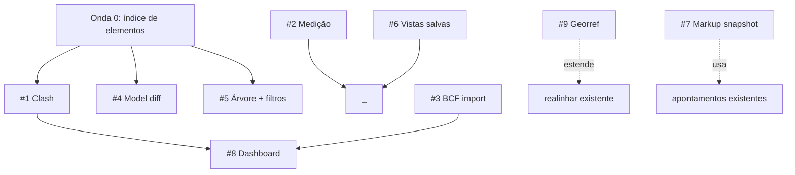

# Plano — Ferramentas do módulo de Compatibilização (Coordenação BIM)

**Data:** 2026-07-21 · **Branch:** `dev` · **Status:** proposto (aguarda aprovação por onda)

Plano de implementação das 9 ferramentas propostas para o módulo **Coordenação**
(`src/modules/coordenacao/`), em fases, com o **modelo de IA recomendado por etapa**.
Cada ferramenta segue o padrão em camadas do módulo (núcleo puro testável → serviço →
action/route → adapter do viewer → UI), o que casa naturalmente com a escolha de modelo.

> Regra do projeto: **avisar sempre qual modelo cada fase pede antes de agir** (memória
> `feedback-alertar-troca-modelo`). Este plano já traz isso por etapa.

---

## Base existente (não refazer)

Viewer federado client-only (`viewer/engine.ts`, three + @thatopen/fragments), toggle/
isolar/ocultar/corte, **apontamentos 3D** (`ApontamentoCoordenacao`), snapshot PNG,
**BCF 2.1 export** (`bcf/writer.ts`), **realinhar/offset** (`deslocar-ifc.ts` + `deslocamento.ts`),
integração de **IFCs recebidos do cliente**, conversão IFC→`.frag` em child process
(`converter-ifc.ts`) via job pg-boss, `viewer/coords.ts` (three↔IFC), `lib/dxf.ts`.

---

## Legenda — quando usar cada modelo

| Modelo | ID | Usar em |
|---|---|---|
| **Opus 4.8** | `claude-opus-4-8` | Decisão de arquitetura, algoritmo/geometria 3D pesada, matemática, orçamento de performance, revisão de risco. As etapas que, se erradas, custam caro. |
| **Sonnet 5** | `claude-sonnet-5` | Implementação padrão bem especificada: núcleo puro (com spec pronto), actions/routes/queries, adapter do viewer, componentes shadcn. O grosso do código. |
| **Haiku 4.5** | `claude-haiku-4-5` | Boilerplate, scaffolding, wiring simples, fixtures/testes repetitivos, ajustes mecânicos, docs de referência. Barato e rápido. |
| **Fable 5** | `claude-fable-5` | Design visual/UX, microcopy pt-BR, dataviz do dashboard, guia ilustrado, ícones/thumbnails. Camada criativa (Sonnet cobre se preferir consolidar). |

Convenção de fase: **F0** spike/decisão · **F1** núcleo puro + testes · **F2** serviço/
action/route · **F3** viewer/UI · **F4** polish/testes/telemetria.

---

## Fundação compartilhada (ONDA 0) — pré-requisito de clash, filtros e diff

Várias ferramentas precisam **enumerar elementos + estrutura espacial** de um modelo
`.frag`/IFC (GUID, IfcClass, pavimento, bbox). Construir isto UMA vez evita reimplementar.

| Fase | Entregável | Modelo | Motivo |
|---|---|---|---|
| F0 | Decidir fonte dos dados: ler do `.frag` no cliente (fragments API) vs. extrair no child (web-ifc) e persistir índice | **Opus 4.8** | Decisão de arquitetura + performance (modelos grandes) |
| F1 | `modules/coordenacao/indice-elementos.ts` — tipos puros (`ElementoIndex`, `NoEspacial`) + montagem da árvore Project→Site→Storey→elemento (puro, testável) | **Sonnet 5** | Bem especificado após F0 |
| F2 | Extração real (adapter no `engine.ts` ou child) + cache por conversão | **Sonnet 5** | Padrão do viewer/adapter |
| F3 | `componentes/coordenacao/arvore-modelo.tsx` (navegador) | **Sonnet 5** | Componente padrão |

Depende de: nada. **Habilita:** #1 clash, #4 diff, #5 filtros.

---

## Ondas e dependências

**Ordem recomendada:** Onda 0 → quick wins (#2, #6) → #1 clash → #5 filtros → #4 diff →
#3 BCF import → #8 dashboard → #7 markup → #9 georref.

---

## #2 Medição (distância, ângulo, área) — QUICK WIN

Objetivo: medir com o mouse no viewport (ponto-a-ponto, ângulo 3 pontos, área de polígono).

| Fase | Entregável | Modelo |
|---|---|---|
| F1 | `medicao.ts` puro: distância/ângulo/área a partir de pontos 3D + formatação por unidade (reusa `realinhamento.ts`/`coords.ts`) + testes | **Sonnet 5** |
| F3 | Modo medição no `engine.ts` (raycast em faces, marcadores/linhas three) | **Sonnet 5** |
| F3 | `medicao-toolbar.tsx` + overlay de rótulos | **Haiku 4.5** |
| F4 | Microcopy + affordância (snap a vértice/aresta opcional) | **Fable 5** |

Sem servidor, sem schema. Risco baixo. **Depende de:** nada.

---

## #6 Vistas salvas (viewpoints) — QUICK WIN

Objetivo: salvar câmera + visibilidade + corte como vista nomeada, reabrir/compartilhar.

| Fase | Entregável | Modelo |
|---|---|---|
| F0 | Persistência: nova tabela `VistaCoordenacao` vs. reuso do shape de câmera dos apontamentos | **Opus 4.8** (decisão de schema) |
| F1 | Schema + migração (à mão, aditiva) | **Haiku 4.5** |
| F2 | `actions.ts`: criar/renomear/excluir vista (via `defineAction`) | **Sonnet 5** |
| F3 | `vistas-painel.tsx` + aplicar (reusa `capturarCamera`/`restaurarCamera`) | **Sonnet 5** |

**Depende de:** nada. Reusa captura/restauração de câmera já existentes.

**Status em 2026-07-28:** ✅ criar, renomear e excluir integrados via `defineAction`;
autor e perfis globais podem alterar, e o painel atualiza o nome localmente.

---

## #1 Detecção automática de conflitos (Clash) — NÚCLEO DO MÓDULO

Objetivo: achar interseções entre elementos de 2+ disciplinas, listar, virar apontamentos,
e gerar **relatório com imagem de cada clash** (câmera no conflito + os 2 elementos realçados).

**Decisões do F0 (2026-07-22, aprovadas):**
- **Roda client-side** nos modelos já carregados — geometria (boxes + malhas) toda disponível
  via fragments (`getBoxes`, `getItemsGeometry`). SEM child process, SEM web-ifc, SEM job.
- **Narrowphase v1 = AABB + tolerância** (encoste não conta); triângulo-a-triângulo (Möller,
  via `getItemsGeometry`) documentado como **v2** (`clash-malha.ts`, refina os pares do v1).
- **Efêmero** — clash recomputa sob demanda; SEM schema/migração. Conflito que importa →
  **1 clique vira apontamento** (o apontamento já persiste, tem status, vira tarefa).

| Fase | Entregável | Modelo | Motivo | Status |
|---|---|---|---|---|
| F0 | Spike + decisões acima | **Opus 4.8** | Geometria + performance, decisão cara | ✅ feito |
| F1 | `clash.ts` (sweep-and-prune X + AABB c/ tolerância), puro, testado | **Opus 4.8** | Algoritmo geométrico crítico | ✅ feito (11 testes) |
| F2 | Adapter no `engine.ts` (junta boxes por disciplina via `getBoxes`, roda `detectarConflitos`, mapeia → view) + realce dos 2 elementos no viewer + câmera no conflito | **Sonnet 5** | Orquestração no engine (client) | ✅ feito |
| F3 | `clash-painel.tsx` (escolher 2 disciplinas, lista, focar no 3D, "virar apontamento") | **Sonnet 5** | Componente + adapter | ✅ feito |
| F3 | **Relatório de clashes**: p/ cada conflito, câmera no centro + realce dos 2 elementos → snapshot; compila HTML (abre em aba, print-to-PDF nativo do navegador — SEM puppeteer/dependência nova) | **Sonnet 5** | Geração de relatório + snapshot | ✅ feito (`relatorio-clash.ts`, 4 testes) |
| F4 | Tuning de tolerância + (opcional) v2 narrowphase triângulo | **Opus 4.8** (v2 geo) | Refino geométrico | ✅ feito (`clash-malha.ts`; fallback AABB sem geometria) |

**Depende de:** Onda 0 (índice/geometria). **v1 sem persistência** (decisão F0).

---

## #5 Árvore espacial + filtros (pavimento/tipo/Pset)

Objetivo: isolar/ocultar por pavimento, IfcClass ou valor de propriedade.

| Fase | Entregável | Modelo |
|---|---|---|
| F1 | `filtros.ts` puro: predicados (por storey/IfcClass/Pset) sobre `ElementoIndex` (Onda 0) + testes | **Sonnet 5** |
| F3 | Aplicar filtro no `engine.ts` (setVisible por localId) | **Sonnet 5** |
| F3 | `filtros-painel.tsx` (checkbox tree de pavimentos/tipos) | **Haiku 4.5** |

**Depende de:** Onda 0.

**Status em 2026-07-28:** ✅ painel integrado à árvore, multifiltro por checkbox
(pavimento/tipo/Pset), propriedades carregadas sob demanda em lotes e isolamento em tempo real.

---

## #4 Comparação de versões (model diff)

Objetivo: entre 2 versões da mesma disciplina — adicionados/removidos/movidos por IfcGuid.

**Decisões do F0 (2026-07-22, aprovadas):** identidade = IfcGuid; "movido" = centro do
bbox deslocou > 1cm (sem parsing de placement; "redimensionado" fica pra v2); dual-load
client-side (antiga+nova), removidos aparecem em vermelho na antiga (descarrega ao sair).

| Fase | Entregável | Modelo | Status |
|---|---|---|---|
| F0 | Decisões acima | **Opus 4.8** | ✅ feito |
| F1 | `diff.ts` puro: conjuntos add/remove + "movido" por delta de centro + testes | **Sonnet 5** | ✅ feito (8 testes) |
| F2 | `queries.ts`/`actions.ts` (versões convertidas do grupo) + `engine.ts` (`rodarDiff` dual-load, `centrosPorGuid`, coloriza verde/âmbar/vermelho, `focarGuid`, `sairDiff`) | **Sonnet 5** | ✅ feito |
| F3 | `diff-painel.tsx` (escolher versões, 3 listas clicáveis, foca no 3D) | **Sonnet 5** | ✅ feito |

**Depende de:** Onda 0 + versionamento existente (que o realinhar já usa).

---

## #3 BCF import (round-trip)

Objetivo: importar `.bcfzip` (Navisworks/Solibri/Revit) → apontamentos; fecha interoperabilidade.

**Decisões do F0 (2026-07-22, aprovadas):** leitura CLIENT-SIDE (resolver guid→modelo
exige o fragments carregado); dep nova `fflate` (unzip isomórfico, sem binário nativo);
parser XML hand-rolled puro (espelha o writer); ancoragem automática por guids +
fallback escolhido pelo usuário quando não bate com nenhum modelo carregado.

| Fase | Entregável | Modelo | Status |
|---|---|---|---|
| F0 | Decisões acima | **Opus 4.8** | ✅ feito |
| F1 | `bcf/reader.ts` puro (parse XML tolerante + viewpoint→câmera), espelho do `writer.ts`; round-trip testado com o writer | **Opus 4.8** | ✅ feito (8 testes) |
| F2 | `fflate` instalado; `bcf/importar.ts` (agrupa zip por pasta, puro); `importarTopicoBcf` action (dedup `bcfGuid`); `resolverModeloPorGuids` no engine | **Sonnet 5** | ✅ feito (5 testes) |
| F3 | `bcf-import-dialog.tsx` (escolhe .bcfzip, resolve modelo por guid ou fallback, importa em lote + snapshot) | **Sonnet 5** | ✅ feito |

**Depende de:** `bcf/writer.ts` (já existia). **Habilita:** melhor #8.

---

## #8 Dashboard de coordenação

Objetivo: apontamentos por disciplina/status, burndown, nº de conflitos abertos.

| Fase | Entregável | Modelo | Motivo |
|---|---|---|---|
| F1 | `queries.ts`: agregações (por disciplina/status/tempo) — só dados existentes | **Sonnet 5** |
| F3 | `dashboard-coordenacao.tsx` — cards + gráficos | **Fable 5** | Dataviz/visual (seguir skill `dataviz`) |
| F4 | Ajuste de acessibilidade/cores (tokens do design system) | **Haiku 4.5** |

**Depende de:** apontamentos (pronto) + idealmente #1 clash.

**Status em 2026-07-28:** ✅ dashboard integrado, incluindo KPI explícito de conflitos abertos.

---

## #7 Markup 2D no snapshot

Objetivo: desenhar seta/círculo/texto sobre o snapshot ao criar apontamento.

| Fase | Entregável | Modelo |
|---|---|---|
| F1 | `markup.ts` puro: modelo de formas (seta/círculo/texto) + serialização | **Sonnet 5** |
| F3 | Editor canvas overlay no fluxo de apontamento (exporta PNG achatado) | **Sonnet 5** |
| F4 | UX das ferramentas de desenho + ícones | **Fable 5** |

**Depende de:** snapshot de apontamento (pronto).

---

## #9 Ajuste de georreferenciamento (`IfcMapConversion`)

Objetivo: complementa o realinhar — definir/editar georref em vez de deslocar placements.

**Decisões do F0 (2026-07-22, aprovadas):** editar E criar (não só editar); IFC4-only
(IfcMapConversion não existe em IFC2X3 — arquivo IFC2X3 é rejeitado com erro claro);
child dedicado `georref-ifc.ts` (não estende deslocar-ifc.ts — operações e validação
diferentes); NÃO mexe em placements (independente/complementar ao offset físico).

| Fase | Entregável | Modelo | Status |
|---|---|---|---|
| F0 | Decisões acima + spike de construção de entidades (web-ifc `IFC4.IfcMapConversion`/`IfcProjectedCRS`) | **Opus 4.8** | ✅ feito |
| F1 | `georref.ts` puro (validação + rotação↔eixo); `scripts/georref-ifc.ts` (ler/gravar, cria OU edita) — validado empiricamente (criar+ler+editar, round-trip de rotação, edição in-place sem duplicar entidades) | **Opus 4.8** | ✅ feito (14 testes) |
| F2 | `georreferenciamento.ts` (orquestrador, espelha `deslocamento.ts`) + `lerGeorreferenciamento`/`gravarGeorreferenciamento` actions | **Sonnet 5** | ✅ feito |
| F3 | `georref-dialog.tsx` (dialog dedicado — sem preview 3D/drag, não se encaixa no painel de realinhar) | **Sonnet 5** | ✅ feito |

**Depende de:** realinhar (pronto). **v1 = só uploads de disciplina** (mesmo escopo do diff #4; recebidos ficam de fora). **Não** commitar IFC de cliente em fixture.

---

## Decisões que EXIGEM aprovação humana (antes de codar cada onda)

1. **Onda 0** — fonte do índice (cliente via fragments vs. child via web-ifc) e se persiste.
2. **#1 Clash** — narrowphase real (malha) vs. só bounding-box no v1; tolerâncias; onde roda.
3. **#4 Diff** — critério de "movido" e custo de 2 modelos em memória.
4. **#3 BCF import** — política de dedup/atualização quando o `bcfGuid` já existe.
5. Qualquer **migração** de schema (#1, #4, #6) — aplicar com `migrate deploy` (aditiva), nunca reset do dev.

## Resumo de esforço / ordem

| Onda | Itens | Esforço | Modelos-chave |
|---|---|---|---|
| 0 | Índice de elementos | Médio | Opus (F0) + Sonnet |
| A (quick wins) | #2 Medição, #6 Vistas | Baixo | Sonnet + Haiku (+Fable UX) |
| B | #1 Clash | Alto | **Opus** (geo) + Sonnet |
| C | #5 Filtros, #4 Diff | Médio | Opus (diff F0) + Sonnet |
| D | #3 BCF import | Médio | Opus (F0) + Sonnet |
| E | #8 Dashboard, #7 Markup, #9 Georref | Médio | Fable/Sonnet + Opus (georref) |

**Fixtures BIM:** sempre sintéticas (nunca IFC de cliente em repo/fixture), como no realinhar.
