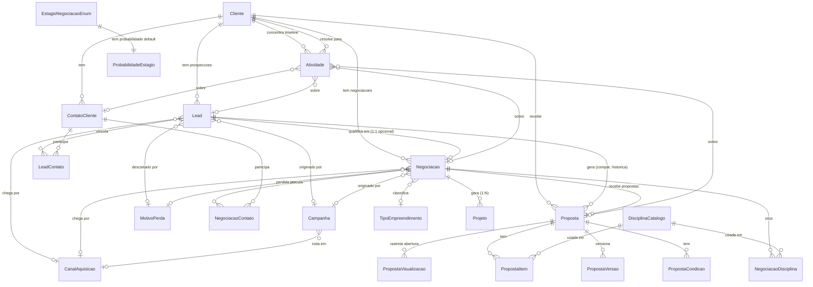

# 02 — Schema alvo do CRM

> Gerado pelo prompt P3. Base: `docs/crm/00-auditoria.md` + `docs/crm/01-decisoes.md`.
> **Nada aqui foi aplicado** — `prisma/schema.prisma` real não foi tocado, nenhuma migration foi gerada.
> Convenção seguida: **nomes de model em português** (mesmo padrão de `Cliente`, `Proposta`, `Lead`,
> `Oportunidade` já existentes no schema real — ver justificativa na seção 8, ponto 1).

---

## 0. Resumo de nomenclatura (leia antes do resto)

O prompt original do playbook usa nomes em inglês (`Company`, `Contact`, `Opportunity`, `Proposal`...)
como *placeholder* de domínio. O schema real do SENAHub **não** segue esse padrão — todo model comercial
hoje é nome em português (`Cliente`, `Lead`, `Oportunidade`, `Proposta`, `FunilEtapa`...). Mapeamento adotado:

| Nome do playbook | Nome usado neste documento | Origem |
|---|---|---|
| Company | **`Cliente`** (evolui, não renomeia) | já existe |
| Contact | **`ContatoCliente`** (evolui, não renomeia) | já existe |
| Lead | **`Lead`** (evolui, não renomeia) | já existe |
| Opportunity | **`Negociacao`** (novo model) | ver seção 8.1 — nome novo pra não colidir com o `Oportunidade` órfão existente |
| Proposal | **`Proposta`** (evolui, não renomeia) | já existe |
| ProposalVersion | **`PropostaVersao`** (evolui, não renomeia) | já existe |
| Activity | **`Atividade`** (novo, unifica `AtividadeLead`+`AtividadeOportunidade`) | novo |
| AuditLog | **`AuditLog`** (reaproveita 100%, já existe no sistema todo) | já existe |
| NextAction | **não desenhado nesta P3** | ver seção 8.2 — decisão adiada pro P11 por instrução do próprio playbook |
| Campaign | **`Campanha`** (novo) | novo |
| PropertyType | **`TipoEmpreendimento`** (novo) | novo |
| Discipline | **`DisciplinaCatalogo`** (JÁ EXISTE — reaproveitar, não criar) | ver correção em 8.1 |
| LossReason | **`MotivoPerda`** (novo) | novo |
| AcquisitionChannel | **`CanalAquisicao`** (novo) | novo |
| Segment | **`Segmento`** (novo) | novo |
| OpportunityDiscipline | **`NegociacaoDisciplina`** (novo) | novo |
| LeadContact | **`LeadContato`** (novo) | novo |
| StageProbability | **`ProbabilidadeEstagio`** (novo) | novo |
| — (não pedido, adicionado) | **`NegociacaoContato`** (novo) | necessário pra "Oportunidade vinculada a Empresa **e contatos**" (P9 item 2) — ver 8.1 |

---

## 1. Diagrama ER (Mermaid)



*(`EstagioNegociacaoEnum` aparece só pra deixar visível a relação conceitual estágio↔probabilidade — não é uma tabela, é o enum de `Negociacao.estagio`.)*

---

## 2. Entidades — definição Prisma

### 2.1 `Cliente` — evolução (não recria)

Campos **novos** adicionados ao model existente (linha 820 do schema real); todo o resto de `Cliente`
permanece como está.

```prisma
model Cliente {
  // ... campos existentes (id, tipo, nome, nomeFantasia, documento, email, telefone,
  //     endereço, observacoes, categoria, ativo, usuarioId) permanecem sem alteração ...

  /// Status comercial CALCULADO (ver seção 6) — materializado para permitir filtro/ordenação em lista.
  status         StatusComercialCliente @default(PROSPECT)
  /// Quando preenchido, VENCE o cálculo automático (ver seção 6).
  statusOverride StatusComercialCliente?

  /// Sales Navigator (P13).
  linkedinUrl         String?
  salesNavigatorUrl   String?

  /// Catálogos (P3/A.3 #12 e correlatos).
  segmentoId String?
  segmento   Segmento? @relation(fields: [segmentoId], references: [id])
  porte      String?   // catálogo simples (mesmo padrão de `categoria` hoje) — sem tabela dedicada por ora

  /// Soft delete (ADR-11).
  excluidoEm DateTime?

  negociacoes Negociacao[]
  atividades  Atividade[]
  leadContatos LeadContato[]     // via ContatoCliente, não direto — ver 2.4

  @@index([status])
  @@index([documento])
}

enum StatusComercialCliente {
  PROSPECT
  CLIENTE
  EX_CLIENTE
  PARCEIRO
}
```

**Restrição de unicidade nova:** `documento` único **só quando preenchido** (ADR-03):
```sql
CREATE UNIQUE INDEX cliente_documento_unico ON cliente (documento) WHERE documento IS NOT NULL;
```
Prisma 7 não tem sintaxe nativa de índice parcial no `schema.prisma` — vai como `CREATE INDEX` manual
dentro da migration gerada (mesmo padrão que o projeto já usa pra esse tipo de constraint).

### 2.2 `ContatoCliente` — evolução (não recria)

```prisma
model ContatoCliente {
  // ... id, clienteId, cliente, nome, cargo, email, telefone, principal permanecem ...

  /// LGPD (T1).
  optOut             Boolean   @default(false)
  optOutAt           DateTime?
  baseLegal          BaseLegalLgpd @default(LEGITIMO_INTERESSE)
  dataCollectionSource String?
  dataCollectedAt    DateTime?

  /// Sales Navigator (P13).
  linkedinUrl       String?
  salesNavigatorUrl String?

  /// Papel na decisão de compra (catálogo simples embutido — não é tabela própria).
  papelDecisao String?

  /// Status de relacionamento do contato (ativo, afastado, ex-empresa etc.) — enum simples.
  statusRelacionamento StatusRelacionamentoContato @default(ATIVO)

  /// Faltava — necessário pra dataCollectedAt ter de onde puxar em registros antigos (Q5).
  createdAt DateTime @default(now())

  leadContatos       LeadContato[]
  negociacaoContatos NegociacaoContato[]

  @@index([email])
  @@index([telefone])
}

enum BaseLegalLgpd {
  LEGITIMO_INTERESSE
}

enum StatusRelacionamentoContato {
  ATIVO
  AFASTADO
  SAIU_DA_EMPRESA
}
```

### 2.3 `Lead` — evolução (não recria)

```prisma
model Lead {
  // ... id, nome, email, telefone permanecem; `contato` (string livre) fica DEPRECADO
  //     (mantido pra exibir histórico, não usado em registros novos) ...

  clienteId String   // era opcional, vira OBRIGATÓRIO (ADR-01) — nasce junto com o Lead
  cliente   Cliente  @relation(fields: [clienteId], references: [id])

  responsavelId String?   // novo (Q4) — só exibição/atribuição, NÃO é gate de permissão (ADR-15 revisado)

  status StatusProspeccao @default(IDENTIFICADO)

  canalId            String?
  canal              CanalAquisicao? @relation(fields: [canalId], references: [id])
  origemDetalhada    String?          // texto livre complementar ao canal (P4 item 4 faz o de-para)
  campaignId         String?
  campanha           Campanha?        @relation(fields: [campaignId], references: [id])

  temperatura Temperatura?

  motivoDescarteId String?
  motivoDescarte   MotivoPerda? @relation(fields: [motivoDescarteId], references: [id])

  /// Marcado pela regra determinística do P4 quando a classificação ficou ambígua (ADR-16).
  needsReview Boolean @default(false)

  /// Soft delete (ADR-11).
  excluidoEm DateTime?

  contatos     LeadContato[]
  negociacao   Negociacao?   // 1:1 opcional — a negociação nascida desta prospecção, se houver

  // `etapaId`/`etapa` (FunilEtapa) e `arquivado`/`motivoPerda` (texto livre) ficam DEPRECIADOS,
  // mantidos só leitura pro histórico pré-migração — ver seção 8.3.

  @@index([clienteId])
  @@index([responsavelId])
  @@index([status])
  @@index([canalId])
  @@index([campaignId])
  @@index([createdAt])
}

enum StatusProspeccao {
  IDENTIFICADO
  CONTATO_INICIADO
  EM_CONTATO
  QUALIFICADO
  OPORTUNIDADE_CRIADA
  SEM_OPORTUNIDADE
  EM_ESPERA
  DESCARTADO
}

enum Temperatura {
  FRIO
  MORNO
  QUENTE
}
```

### 2.4 `LeadContato` — nova (junção)

```prisma
model LeadContato {
  id        String  @id @default(cuid())
  leadId    String
  lead      Lead    @relation(fields: [leadId], references: [id], onDelete: Cascade)
  contatoId String
  contato   ContatoCliente @relation(fields: [contatoId], references: [id])
  /// Contato principal PARA ESTA prospecção especificamente (pode diferir do principal da empresa).
  principal Boolean @default(false)

  @@unique([leadId, contatoId])
  @@index([contatoId])
  @@map("lead_contato")
}
```

### 2.5 `Negociacao` — nova (substitui o papel pretendido, nunca cumprido, do `Oportunidade` órfão)

```prisma
model Negociacao {
  id        String  @id @default(cuid())
  titulo    String
  clienteId String
  cliente   Cliente @relation(fields: [clienteId], references: [id])
  leadId    String? @unique   // origem, se veio de uma prospecção qualificada
  lead      Lead?   @relation(fields: [leadId], references: [id])

  responsavelId String?

  tipoEmpreendimentoId String?
  tipoEmpreendimento   TipoEmpreendimento? @relation(fields: [tipoEmpreendimentoId], references: [id])
  areaM2 Decimal? @db.Decimal(12, 2)

  valorEstimado  Decimal? @db.Decimal(14, 2)
  valorProposto  Decimal? @db.Decimal(14, 2)
  valorNegociado Decimal? @db.Decimal(14, 2)
  desconto       Decimal? @db.Decimal(14, 2)   // valor OU percentual — resolvido na UI, guardado como percentual (0-100)

  probabilidade         Int      @default(0)   // 0-100; populado a partir de ProbabilidadeEstagio no create/transição
  probabilidadeOverride Boolean  @default(false) // true = usuário sobrescreveu manualmente, não recalcula mais sozinho

  temperatura Temperatura?
  estagio     EstagioNegociacao @default(LEVANTAMENTO)

  motivoPerdaId String?
  motivoPerda   MotivoPerda? @relation(fields: [motivoPerdaId], references: [id])
  /// Preenchido só quando motivoPerda.exigeConcorrente = true.
  concorrente   String?

  previsaoFechamento DateTime?
  dataFechamento     DateTime?  // preenchido quando estagio vira CONTRATADO ou PERDIDO

  canalId    String?
  canal      CanalAquisicao? @relation(fields: [canalId], references: [id])
  campaignId String?
  campanha   Campanha?       @relation(fields: [campaignId], references: [id])

  /// Ver ADR-16 / mesma lógica do Lead — cobre os registros recuperados do `Oportunidade` órfão,
  /// SE a decisão Q2 for por reaproveitar dados em vez de descartar.
  needsReview Boolean @default(false)

  /// Soft delete (ADR-11).
  excluidoEm DateTime?

  createdAt DateTime @default(now())
  updatedAt DateTime @updatedAt

  contatos    NegociacaoContato[]
  disciplinas NegociacaoDisciplina[]
  propostas   Proposta[]
  atividades  Atividade[]
  projetos    Projeto[]   // 1:N (ADR-06) — FK fica no lado Projeto (ver 2.13)

  @@index([clienteId])
  @@index([responsavelId])
  @@index([estagio])
  @@index([dataFechamento])
  @@index([canalId])
  @@index([campaignId])
  @@index([createdAt])
  @@map("negociacao")
}

enum EstagioNegociacao {
  LEVANTAMENTO
  ORCAMENTO
  PROPOSTA_ENVIADA
  NEGOCIACAO
  CONTRATADO
  PERDIDO
  EM_ESPERA
  CANCELADO
}
```

### 2.6 `NegociacaoContato` — nova (junção, adição justificada)

> Não pedida explicitamente na lista mínima do prompt, mas necessária: o P9 item 2 diz *"Model
> Opportunity, vinculado a Empresa **e contatos**"* — sem essa tabela não dá pra cumprir esse requisito.

```prisma
model NegociacaoContato {
  id           String     @id @default(cuid())
  negociacaoId String
  negociacao   Negociacao @relation(fields: [negociacaoId], references: [id], onDelete: Cascade)
  contatoId    String
  contato      ContatoCliente @relation(fields: [contatoId], references: [id])
  principal    Boolean    @default(false)

  @@unique([negociacaoId, contatoId])
  @@index([contatoId])
  @@map("negociacao_contato")
}
```

### 2.7 `NegociacaoDisciplina` — nova (junção)

```prisma
model NegociacaoDisciplina {
  id             String     @id @default(cuid())
  negociacaoId   String
  negociacao     Negociacao @relation(fields: [negociacaoId], references: [id], onDelete: Cascade)
  disciplinaId   String
  disciplina     DisciplinaCatalogo @relation(fields: [disciplinaId], references: [id])
  /// Valor opcional por disciplina (ADR-13) — mesmo padrão de PropostaItem.valor.
  valor          Decimal?   @db.Decimal(14, 2)

  @@unique([negociacaoId, disciplinaId])
  @@map("negociacao_disciplina")
}
```

### 2.8 `Proposta` — evolução (não recria)

```prisma
model Proposta {
  // ... id, ano, sequencial, numero, titulo, token, autorId, enviadaEm, aceitaEm,
  //     projetoId permanecem EXATAMENTE como estão — não mexer (link público já em uso) ...

  clienteId String   // continua obrigatório, sem mudança
  leadId    String?  // continua — compat. histórica, não removido

  negociacaoId String?   // nullable na fase EXPAND; vira obrigatório só na fase SWITCH (ver P4)
  negociacao   Negociacao? @relation(fields: [negociacaoId], references: [id])

  status StatusProposta @default(rascunho)   // ganha 1 valor novo: em_negociacao (ver enum abaixo)

  @@index([negociacaoId])
}

enum StatusProposta {
  rascunho
  enviada
  em_negociacao   // novo (P14 item 4)
  aceita
  recusada
  // "visualizada" NÃO entra como estado de transição — ver seção 8.4 (não inventar o que não existe hoje)
}
```

`PropostaItem.disciplina` (`String` livre hoje) evolui pra FK:
```prisma
model PropostaItem {
  // id, propostaId, descricao, valor, ordem permanecem
  disciplinaId String
  disciplina   DisciplinaCatalogo @relation(fields: [disciplinaId], references: [id])
  // campo antigo `disciplina: String` fica como `disciplinaTextoLegado` (deprecado, só leitura,
  // preservando o texto original digitado antes da migração — mesmo padrão do "Outro" do P4 item 4)
}
```

### 2.9 `PropostaVersao` — evolução (estrutura os campos hoje soltos num JSON)

```prisma
model PropostaVersao {
  // id, propostaId, numero, autorId, createdAt permanecem
  snapshot Json   // mantém — ainda guarda itens/condições linha a linha

  /// Campos estruturados novos (P14 item 3) — evitam parsear o JSON pra relatório/comparação.
  valorOriginal Decimal?  @db.Decimal(14, 2)
  valorVersao   Decimal?  @db.Decimal(14, 2)
  desconto      Decimal?  @db.Decimal(14, 2)
  status        StatusProposta?
  validade      DateTime? @db.Date
  dataEnvio     DateTime?
  observacao    String?
}
```

### 2.10 `Atividade` — nova (unifica `AtividadeLead` + `AtividadeOportunidade`)

```prisma
model Atividade {
  id        String   @id @default(cuid())
  tipo      TipoAtividade @default(NOTA)
  descricao String
  autorId   String
  autor     User     @relation(fields: [autorId], references: [id])
  metadata  Json?

  /// Toda Atividade resolve pra uma Empresa (P12 item 1) — pra timeline da Empresa 360 agregar tudo.
  clienteId String
  cliente   Cliente  @relation(fields: [clienteId], references: [id])

  contatoId    String?
  leadId       String?
  negociacaoId String?
  propostaId   String?

  contato    ContatoCliente? @relation(fields: [contatoId], references: [id])
  lead       Lead?           @relation(fields: [leadId], references: [id])
  negociacao Negociacao?     @relation(fields: [negociacaoId], references: [id])
  proposta   Proposta?       @relation(fields: [propostaId], references: [id])

  createdAt DateTime @default(now())

  @@index([clienteId, createdAt])
  @@index([leadId])
  @@index([negociacaoId])
  @@map("atividade")
}

enum TipoAtividade {
  LIGACAO
  WHATSAPP
  EMAIL
  LINKEDIN
  REUNIAO
  NOTA
  ANEXO
  SISTEMA   // eventos automáticos (mudança de etapa, criação, etc. — P12 item 2)
}
```
`AtividadeLead`/`AtividadeOportunidade` ficam **deprecados** (não apagados) — histórico pré-migração
continua legível; nada novo escreve neles depois do SWITCH.

### 2.11 Catálogos — todos no mesmo formato simples

```prisma
model TipoEmpreendimento {
  id     String  @id @default(cuid())
  nome   String  @unique
  ativo  Boolean @default(true)
  ordem  Int     @default(0)
  negociacoes Negociacao[]
  @@map("tipo_empreendimento")
}

// ⚠️ CORREÇÃO (2026-08-13): NÃO criar `DisciplinaPadrao`. O catálogo já existe.
// `DisciplinaCatalogo` (schema.prisma:906) já tem nome@unique, codigo (sigla), numeracao,
// categoria, icone, ativo, ordem — e vem seedado com 20 disciplinas. Só ganha as relações novas:
model DisciplinaCatalogo {
  // ... id, nome, codigo, numeracao, categoria, icone, iconeSvg, ativo, ordem permanecem ...
  padroes         PadraoTecnico[]         // já existe
  negociacaoItens NegociacaoDisciplina[]  // novo
  propostaItens   PropostaItem[]          // novo
}

model MotivoPerda {
  id               String  @id @default(cuid())
  nome             String  @unique
  ativo            Boolean @default(true)
  ordem            Int     @default(0)
  /// Quando true, a UI exige preencher `Negociacao.concorrente` ao selecionar este motivo.
  exigeConcorrente Boolean @default(false)
  leads       Lead[]
  negociacoes Negociacao[]
  @@map("motivo_perda")
}

model CanalAquisicao {
  id     String  @id @default(cuid())
  nome   String  @unique
  ativo  Boolean @default(true)
  ordem  Int     @default(0)
  leads       Lead[]
  negociacoes Negociacao[]
  campanhas   Campanha[]
  @@map("canal_aquisicao")
}

model Segmento {
  id     String  @id @default(cuid())
  nome   String  @unique
  ativo  Boolean @default(true)
  ordem  Int     @default(0)
  clientes Cliente[]
  @@map("segmento")
}
```

### 2.12 `Campanha` — nova

```prisma
model Campanha {
  id             String    @id @default(cuid())
  nome           String
  canalId        String?
  canal          CanalAquisicao? @relation(fields: [canalId], references: [id])
  periodoInicio  DateTime? @db.Date
  periodoFim     DateTime? @db.Date
  responsavelId  String?
  meta           Decimal?  @db.Decimal(14, 2)
  observacao     String?
  ativo          Boolean   @default(true)
  createdAt      DateTime  @default(now())

  leads       Lead[]
  negociacoes Negociacao[]

  @@index([canalId])
  @@map("campanha")
}
```

### 2.13 `Projeto` — só o gancho novo (não mexe no resto do model, fora de escopo)

```prisma
model Projeto {
  // ... permanece 100% como está ...
  negociacaoId String?
  negociacao   Negociacao? @relation(fields: [negociacaoId], references: [id])
  @@index([negociacaoId])
}
```
`Proposta.projetoId` (hoje `@unique`) **deixa de ser a fonte da relação Projeto↔comercial** — o vínculo
"de onde veio esse projeto" passa a ser `Projeto.negociacaoId`. `Proposta.projetoId` continua existindo
por compatibilidade (qual proposta especificamente gerou aquele projeto), só perde a exclusividade
de ser o único caminho (ver ADR-06 e risco 8.5).

### 2.14 `ProbabilidadeEstagio` — nova (tabela de configuração)

```prisma
model ProbabilidadeEstagio {
  estagio      EstagioNegociacao @id
  probabilidade Int              // 0-100

  @@map("probabilidade_estagio")
}
```
Seed inicial (P6): `LEVANTAMENTO=20, ORCAMENTO=35, PROPOSTA_ENVIADA=55, NEGOCIACAO=75, CONTRATADO=100`
(estágios terminais `PERDIDO/EM_ESPERA/CANCELADO` não entram na tabela — probabilidade nesses casos é 0
ou não se aplica, resolvido na camada de serviço, não no banco).

---

## 3. O que cada entidade nova substitui/evolui/complementa

| Entidade | Relação com o que já existe |
|---|---|
| `Cliente` (campos novos) | **Evolui** — mesmo registro, ganha status derivado + LGPD indireto (via segmento) + soft delete |
| `ContatoCliente` (campos novos) | **Evolui** — ganha LGPD, Sales Navigator, `createdAt` |
| `Lead` (campos novos) | **Evolui** — mesmo registro físico, ganha funil próprio de prospecção e deixa de precisar de `Oportunidade` pra virar negócio real |
| `LeadContato` | **Complementa** — substitui o uso de `Lead.contato` (texto livre) por relação estruturada |
| `Negociacao` | **Substitui** o papel nunca cumprido do `Oportunidade` órfão — não é migração de dado automática (ver Q2/8.1) |
| `NegociacaoContato`, `NegociacaoDisciplina` | **Complementam** `Negociacao` — não existiam em forma nenhuma antes |
| `Proposta` (campos novos) | **Evolui** — todo o núcleo (numeração, token, PDF, pixel) intocado |
| `PropostaVersao` (campos novos) | **Evolui** — o `snapshot` JSON continua, ganha campos estruturados ao lado |
| `Atividade` | **Substitui/unifica** `AtividadeLead` + `AtividadeOportunidade` — as duas antigas ficam congeladas, não apagadas |
| `Campanha`, `TipoEmpreendimento`, `MotivoPerda`, `CanalAquisicao`, `Segmento` | **Complementam** — catálogos que hoje são texto livre espalhado |
| `DisciplinaCatalogo` | **JÁ EXISTE, seedado** — só ganha as FKs novas. Ver 8.1 |
| `ProbabilidadeEstagio` | **Complementa** — não existia nenhum conceito de probabilidade no schema atual |
| `Projeto.negociacaoId` | **Complementa** — `Proposta.projetoId` continua existindo, ganha um caminho paralelo |

---

## 4. Índices propostos (com a query que cada um serve)

| Dimensão pedida | Índice real | Query que serve |
|---|---|---|
| companyId | `Lead(clienteId)`, `Negociacao(clienteId)`, `Atividade(clienteId, createdAt)` | "tudo dessa empresa" (Empresa 360) |
| contactId | `LeadContato(contatoId)`, `NegociacaoContato(contatoId)`, `ContatoCliente(email)`, `ContatoCliente(telefone)` | achar por e-mail/telefone (dedupe P8), "em que leads/negociações esse contato aparece" |
| ownerId | `Lead(responsavelId)`, `Negociacao(responsavelId)` | "Meus x Todos" (P16) |
| status | `Lead(status)`, `Cliente(status)` | filtro de funil de prospecção / lista de clientes por status comercial |
| stage | `Negociacao(estagio)` | Kanban de negociação, funil de conversão (P17) |
| nextActionDate | *(não criado agora — ver 8.2, tabela de próxima ação adiada pro P11)* | — |
| createdAt | `Lead(createdAt)`, `Negociacao(createdAt)` | coorte de criação (P15 — conversão por coorte) |
| closedAt | `Negociacao(dataFechamento)` | relatório de fechamento por período |
| acquisitionChannel | `Lead(canalId)`, `Negociacao(canalId)`, `Campanha(canalId)` | análise por canal (P17 item 4) |
| campaignId | `Lead(campaignId)`, `Negociacao(campaignId)` | análise por campanha (P17 item 4) |
| — (adicional) | `Cliente(documento)` (btree, além do unique parcial) | busca rápida por CNPJ digitado |
| — (adicional) | `Proposta(negociacaoId)` | listar propostas de uma negociação |

---

## 5. Restrições de unicidade

- `Cliente.documento` — único **somente quando preenchido** (índice parcial, ver 2.1). Pré-requisito:
  script de auditoria de duplicata (P4) rodar limpo antes da migration que cria o índice.
- `Proposta.numero`, `Proposta.token`, `Proposta.(ano,sequencial)` — **mantidos exatamente como estão**,
  zero mudança (link público e numeração já em uso por clientes reais).
- `LeadContato.(leadId, contatoId)` e `NegociacaoContato.(negociacaoId, contatoId)` — um contato não
  entra duas vezes na mesma prospecção/negociação.
- `NegociacaoDisciplina.(negociacaoId, disciplinaId)` — uma disciplina não se repete na mesma negociação.
- `TipoEmpreendimento.nome`, `MotivoPerda.nome`, `CanalAquisicao.nome`,
  `Segmento.nome` — catálogos com nome único (mesmo padrão de `FunilEtapa.nome`/`TabelaPreco.nome` hoje).
- `Negociacao.leadId` — `@unique`: uma prospecção qualifica em **no máximo uma** negociação (impede
  qualificar o mesmo lead duas vezes, criando negociações duplicadas da mesma origem).
- **Pendente de conteúdo, não de estrutura:** unicidade "1 prospecção ativa por empresa+campanha"
  (ADR-02/Q1) — índice único parcial `(clienteId, campaignId) WHERE status NOT IN (...)`, a lista exata
  de status "fechados" que saem da constraint é definida junto da regra de classificação no P4 (mesmo
  motivo do documento — depende de conteúdo que ainda não foi escrito).

---

## 6. Status comercial da Empresa — como é derivado

`Cliente.status` é **materializado** (coluna real, não calculada só na leitura) porque listas grandes
de clientes precisam filtrar/ordenar por status com índice — calcular em toda leitura não escala.

Regra (função pura, testável, mesmo padrão de `saudeProjeto`/`caminho-critico`):
```
calcularStatusComercial(cliente):
  se cliente.statusOverride != null → retorna statusOverride   (override sempre vence)
  senão se existe Proposta(clienteId=cliente.id, status="aceita") → CLIENTE
  senão → PROSPECT
```
- `EX_CLIENTE` e `PARCEIRO` **nunca são calculados automaticamente** — não existe sinal de dado no
  sistema hoje que justifique inferir "esse cliente parou de comprar" ou "isso é uma parceria" (não
  inventar, conforme guardrail). Os dois só entram via `statusOverride` manual.
- O recálculo roda no service, chamado nos pontos de mutação relevantes: `aceitarProposta` (novo status
  vira CLIENTE), fusão de clientes (P8 — o sobrevivente herda o status mais "avançado" dos dois), e uma
  ação manual de "recalcular" pra corrigir drift, se algum dia o service mudar de regra.

---

## 7. Campos de LGPD no Contact (`ContatoCliente`)

Já detalhado na seção 2.2: `optOut`, `optOutAt`, `baseLegal` (fixo em `LEGITIMO_INTERESSE` por ora, mas
campo em vez de constante pra não travar se um dia precisar de outra base legal), `dataCollectionSource`,
`dataCollectedAt`. Regra de uso: toda lista de abordagem/exportação (P13 item 6) filtra
`WHERE optOut = false` — a checagem fica centralizada numa função (`podeAbordar(contato)`), não repetida
em cada query, pro dia que a regra crescer (ex.: expiração de consentimento) não precisar caçar todo
lugar que esqueceram de checar.

---

## 8. Riscos e pontos onde escolhi entre duas modelagens

### 8.1 Nomenclatura: `Negociacao` ✅ aprovado · `DisciplinaPadrao` ❌ cancelado

**`Negociacao` — aprovado pelo usuário (2026-08-13).** O nome do playbook (`Opportunity` → `Oportunidade`)
colide com o model órfão existente, e Prisma não aceita dois models homônimos. Renomear o antigo estaria
fora do escopo. `Negociacao` resolve sem tocar em nada — e como a Q2 fechou em "descartar o órfão", o
nome antigo simplesmente sai de cena junto com o model.

**`DisciplinaPadrao` — CANCELADO (correção de 2026-08-13).** A premissa estava errada: eu havia
registrado na auditoria que não existia catálogo de disciplinas. **Existe** — `DisciplinaCatalogo`
(`prisma/schema.prisma:906`), seedado com 20 disciplinas (`prisma/seed.ts:285`), com `nome` @unique,
`codigo` (sigla p/ nomenclatura de arquivo), `numeracao` (bloco-base da folha), `categoria`, ícone,
`ativo`/`ordem`. Já é usado por `PadraoTecnico`, `modules/engenharia`, `modules/projetos`,
`modules/ferramentas` e `api/uploads`.

Criar um segundo catálogo teria sido o pior resultado possível: **duas fontes de verdade concorrentes**
para a mesma coisa, cada uma alimentando metade do sistema. O CRM passa a apontar para
`DisciplinaCatalogo`; não há model novo.

O que de fato falta não é o catálogo, é a **FK**: `Disciplina.nome` (por-projeto),
`PropostaItem.disciplina` e `ItemTabelaPreco.disciplina` são strings livres. O catálogo existe, mas nada
obriga a usá-lo — é daí que vêm as 24 grafias distintas encontradas em produção.

> Fica de lição para o resto da reforma: antes de criar catálogo/tabela "nova", conferir se o sistema já
> tem uma. Este schema tem 158 migrations de história — a chance de já existir é real.

### 8.2 `NextAction` não desenhado nesta P3
O próprio playbook (P11, mais adiante) instrui: *"ANTES de criar qualquer coisa: verifique o sistema de
compromissos/follow-ups que já existe... Prefira reaproveitar. Espere minha confirmação se a resposta
for 'criar novo'."* Isso é uma instrução de **execução** (P11), não de schema antecipado (P3) — desenhar
a tabela agora seria decidir por antecipação algo que o próprio plano reserva pra depois. Duas
alternativas mapeadas pra quando chegar lá:
- **(a) Estender `Compromisso`** (`prisma/schema.prisma:3231`, já tem `titulo, inicio, fim, criadorId,
  participantes`) com `tipo` (enum da lista do P11 item 3), `entidadeTipo`/`entidadeId` (âncora
  polimórfica pro Lead/Negociação), `concluidoEm`. Risco: `Compromisso` é usado pelo sistema de agenda
  inteiro — misturar semântica de "tarefa comercial" com "reunião de calendário" pode poluir as duas.
- **(b) Tabela nova `ProximaAcao`**, dedicada, sem tocar em `Compromisso`. Mais limpo, mas duplica
  conceito de "coisa agendada com data" que talvez devesse ser uma coisa só no sistema.
- *Minha inclinação, sem decidir agora: (b).* Mas isso é conversa do P11, com o benefício de já ver o
  uso real do CRM rodando antes de comprometer o schema.

### 8.3 O que acontece com `FunilEtapa` (funil configurável de hoje)
Hoje um admin pode criar/renomear etapas livremente (`criarEtapaFunil`/`editarEtapaFunil`). O funil novo
de Prospecção (`StatusProspeccao`) é um **enum fixo**, não mais uma tabela configurável — segue
literalmente o que o P9 pede (`IDENTIFICADO → CONTATO_INICIADO → ...`). Isso é uma **perda de
flexibilidade** deliberada: hoje é configurável, no schema alvo não é. Trade-off aceito porque:
(1) o P9 pede estágios fixos explicitamente, e (2) estágio configurável livre é o que hoje permite o
nome ambíguo "Perdido" ser detectado por substring (`etapaEhPerdido`, dívida já flagada na auditoria) —
fixar o enum elimina essa fragilidade de vez. Custo: qualquer etapa customizada que algum admin tenha
criado além das 5 seedadas vira candidata a `needsReview` na migração (P4), sem mapeamento automático.
`FunilEtapa` como tabela **não é apagada** — fica órfã, preservando o histórico de `Lead.etapaId` até o
CONTRACT.

### 8.4 `PropostaVisualizacao` não virou o estado `VISUALIZADA`
O P14 item 4 pede o status só *"se o rastreio já existir hoje"*. Ele existe (`PropostaVisualizacao`, via
pixel), mas hoje é **um registro de evento** (pode ter várias aberturas), não uma transição de estado
única. Modelar como estado do `StatusProposta` implicaria decidir "quantas aberturas viram
'visualizada'" e se isso reverte — regra que não existe hoje. Escolha: manter `PropostaVisualizacao`
como está (evento) e, se quiser mostrar "visualizada" na UI, é uma leitura derivada
(`visualizacoes.length > 0`), não uma nova coluna de estado. Evita inventar uma regra de negócio nova
que ninguém pediu explicitamente.

### 8.5 `Proposta.projetoId` deixa de ser o único caminho pra `Projeto`
Hoje `aceitarProposta` cria o `Projeto` e grava só em `Proposta.projetoId` (`@unique`). Com
`Negociacao 1:N Projeto` (ADR-06), o vínculo "de onde veio esse projeto" muda de dono. Risco real: **dois
lugares agora podem responder "de onde veio esse projeto"** (`Proposta.projetoId` e
`Projeto.negociacaoId`) — se a lógica de aceite não gravar os dois de forma consistente, fica
divergência silenciosa. Mitigação proposta pro P9/P14: a transação de aceite grava os dois sempre
juntos, nunca um sem o outro, e um teste dedicado garante isso (ver P14 item 9, "caminho completo
proposta → projeto").

### 8.6 Soft delete em `Cliente` tem raio de explosão grande
`Cliente` é referenciado por `Projeto`, `Lancamento`, `Documento`, `DocumentoJuridico`, `CustoOrcamento`
e mais — módulos totalmente fora do escopo do CRM. Adicionar `excluidoEm` e a extensão do Prisma client
que auto-filtra (mesmo padrão de `Lancamento`, `lib/prisma.ts`) precisa ser testada contra **todo** lugar
que hoje faz `prisma.cliente.findMany`/`findUnique` sem esperar um filtro automático — inclusive fora do
Comercial. Risco de regressão silenciosa em módulos não tocados por esta reforma. Recomendo tratar isso
como uma tarefa própria e isolada nas fases de implementação (não misturar com Fase 1a/1b), com um
grep completo de todo uso de `prisma.cliente` no repo antes de ligar a extensão.

---

*Próximo passo: P4 — plano de migração de dados (`docs/crm/03-migracao.md`), aguardando confirmação da
nomenclatura (8.1) e leitura desta P3 antes de rodar.*
