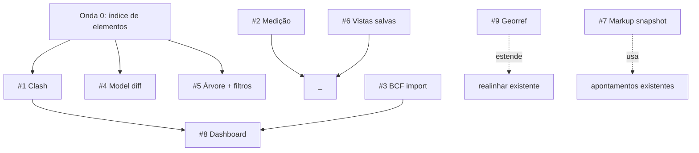

# Plano — Ferramentas do módulo de Compatibilização (Coordenação BIM)

**Data:** 2026-07-21 · **Branch:** `dev` · **Status:** proposto (aguarda aprovação por onda)

Plano de implementação das 9 ferramentas propostas para o módulo **Coordenação**
(`src/modules/coordenacao/`), em fases, com o **modelo de IA recomendado por etapa**.
Cada ferramenta segue o padrão em camadas do módulo (núcleo puro testável → serviço →
action/route → adapter do viewer → UI), o que casa naturalmente com a escolha de modelo.

> Regra do projeto: **avisar sempre qual modelo cada fase pede antes de agir** (memória
> `feedback-alertar-troca-modelo`). Este plano já traz isso por etapa.

---

## Base existente (não refazer)

Viewer federado client-only (`viewer/engine.ts`, three + @thatopen/fragments), toggle/
isolar/ocultar/corte, **apontamentos 3D** (`ApontamentoCoordenacao`), snapshot PNG,
**BCF 2.1 export** (`bcf/writer.ts`), **realinhar/offset** (`deslocar-ifc.ts` + `deslocamento.ts`),
integração de **IFCs recebidos do cliente**, conversão IFC→`.frag` em child process
(`converter-ifc.ts`) via job pg-boss, `viewer/coords.ts` (three↔IFC), `lib/dxf.ts`.

---

## Legenda — quando usar cada modelo

| Modelo | ID | Usar em |
|---|---|---|
| **Opus 4.8** | `claude-opus-4-8` | Decisão de arquitetura, algoritmo/geometria 3D pesada, matemática, orçamento de performance, revisão de risco. As etapas que, se erradas, custam caro. |
| **Sonnet 5** | `claude-sonnet-5` | Implementação padrão bem especificada: núcleo puro (com spec pronto), actions/routes/queries, adapter do viewer, componentes shadcn. O grosso do código. |
| **Haiku 4.5** | `claude-haiku-4-5` | Boilerplate, scaffolding, wiring simples, fixtures/testes repetitivos, ajustes mecânicos, docs de referência. Barato e rápido. |
| **Fable 5** | `claude-fable-5` | Design visual/UX, microcopy pt-BR, dataviz do dashboard, guia ilustrado, ícones/thumbnails. Camada criativa (Sonnet cobre se preferir consolidar). |

Convenção de fase: **F0** spike/decisão · **F1** núcleo puro + testes · **F2** serviço/
action/route · **F3** viewer/UI · **F4** polish/testes/telemetria.

---

## Fundação compartilhada (ONDA 0) — pré-requisito de clash, filtros e diff

Várias ferramentas precisam **enumerar elementos + estrutura espacial** de um modelo
`.frag`/IFC (GUID, IfcClass, pavimento, bbox). Construir isto UMA vez evita reimplementar.

| Fase | Entregável | Modelo | Motivo |
|---|---|---|---|
| F0 | Decidir fonte dos dados: ler do `.frag` no cliente (fragments API) vs. extrair no child (web-ifc) e persistir índice | **Opus 4.8** | Decisão de arquitetura + performance (modelos grandes) |
| F1 | `modules/coordenacao/indice-elementos.ts` — tipos puros (`ElementoIndex`, `NoEspacial`) + montagem da árvore Project→Site→Storey→elemento (puro, testável) | **Sonnet 5** | Bem especificado após F0 |
| F2 | Extração real (adapter no `engine.ts` ou child) + cache por conversão | **Sonnet 5** | Padrão do viewer/adapter |
| F3 | `componentes/coordenacao/arvore-modelo.tsx` (navegador) | **Sonnet 5** | Componente padrão |

Depende de: nada. **Habilita:** #1 clash, #4 diff, #5 filtros.

---

## Ondas e dependências

**Ordem recomendada:** Onda 0 → quick wins (#2, #6) → #1 clash → #5 filtros → #4 diff →
#3 BCF import → #8 dashboard → #7 markup → #9 georref.

---

## #2 Medição (distância, ângulo, área) — QUICK WIN

Objetivo: medir com o mouse no viewport (ponto-a-ponto, ângulo 3 pontos, área de polígono).

| Fase | Entregável | Modelo |
|---|---|---|
| F1 | `medicao.ts` puro: distância/ângulo/área a partir de pontos 3D + formatação por unidade (reusa `realinhamento.ts`/`coords.ts`) + testes | **Sonnet 5** |
| F3 | Modo medição no `engine.ts` (raycast em faces, marcadores/linhas three) | **Sonnet 5** |
| F3 | `medicao-toolbar.tsx` + overlay de rótulos | **Haiku 4.5** |
| F4 | Microcopy + affordância (snap a vértice/aresta opcional) | **Fable 5** |

Sem servidor, sem schema. Risco baixo. **Depende de:** nada.

---

## #6 Vistas salvas (viewpoints) — QUICK WIN

Objetivo: salvar câmera + visibilidade + corte como vista nomeada, reabrir/compartilhar.

| Fase | Entregável | Modelo |
|---|---|---|
| F0 | Persistência: nova tabela `VistaCoordenacao` vs. reuso do shape de câmera dos apontamentos | **Opus 4.8** (decisão de schema) |
| F1 | Schema + migração (à mão, aditiva) | **Haiku 4.5** |
| F2 | `actions.ts`: criar/renomear/excluir vista (via `defineAction`) | **Sonnet 5** |
| F3 | `vistas-painel.tsx` + aplicar (reusa `capturarCamera`/`restaurarCamera`) | **Sonnet 5** |

**Depende de:** nada. Reusa captura/restauração de câmera já existentes.

---

## #1 Detecção automática de conflitos (Clash) — NÚCLEO DO MÓDULO

Objetivo: achar interseções entre elementos de 2+ disciplinas, listar, virar apontamentos.

| Fase | Entregável | Modelo | Motivo |
|---|---|---|---|
| F0 | **Spike + decisão**: broadphase (grade/BVH de bounding boxes) + narrowphase (interseção de malha triangular ou só bbox no v1); onde roda (child process, como conversão); orçamento de tempo/memória; tolerância (hard/clearance clash) | **Opus 4.8** | Geometria + performance, decisão cara |
| F1 | `clash/broadphase.ts` (grade uniforme/AABB sweep) + `clash/narrowphase.ts` (SAT/triângulo-triângulo) — **puros, muito testados** | **Opus 4.8** | Algoritmo geométrico crítico |
| F1 | `clash/estado.ts` (agrupamento, dedup, severidade) puro + testes | **Sonnet 5** | Especificado após F1 geo |
| F2 | `scripts/detectar-clash.ts` (child process, lê `.frag`/geometria) + job pg-boss `detectar-clash` + `clash.ts` (orquestrador, injetável) | **Opus 4.8** | Performance + isolamento de processo |
| F2 | `ConflitoCoordenacao` (schema + migração) + `actions.ts` (rodar clash, converter conflito→apontamento) | **Sonnet 5** | Padrão de action/schema |
| F3 | `clash-painel.tsx` (matriz disciplina×disciplina, lista de conflitos, deep-link 3D) + realce dos pares no viewer | **Sonnet 5** | Componente + adapter |
| F4 | Fixtures sintéticas (2 IFCs que colidem), testes e2e, tuning de tolerância | **Haiku 4.5** | Boilerplate/fixtures |

**Depende de:** Onda 0 (índice/geometria). Maior valor, maior risco → **começar pelo F0/F1 em Opus**.

---

## #5 Árvore espacial + filtros (pavimento/tipo/Pset)

Objetivo: isolar/ocultar por pavimento, IfcClass ou valor de propriedade.

| Fase | Entregável | Modelo |
|---|---|---|
| F1 | `filtros.ts` puro: predicados (por storey/IfcClass/Pset) sobre `ElementoIndex` (Onda 0) + testes | **Sonnet 5** |
| F3 | Aplicar filtro no `engine.ts` (setVisible por localId) | **Sonnet 5** |
| F3 | `filtros-painel.tsx` (checkbox tree de pavimentos/tipos) | **Haiku 4.5** |

**Depende de:** Onda 0.

---

## #4 Comparação de versões (model diff)

Objetivo: entre 2 versões da mesma disciplina — adicionados/removidos/movidos por IfcGuid.

| Fase | Entregável | Modelo | Motivo |
|---|---|---|---|
| F0 | Decisão: chave de identidade (GUID) + como detectar "movido" (delta de bbox/placement além de tolerância) + custo de carregar 2 modelos | **Opus 4.8** | Semântica de diff + performance |
| F1 | `diff.ts` puro: conjuntos add/remove + "movido" por comparação de âncoras + testes | **Sonnet 5** |
| F3 | Modo diff no viewer (verde/vermelho/amarelo por status) + carregar 2 versões | **Sonnet 5** |
| F3 | `diff-painel.tsx` (resumo + lista navegável) | **Haiku 4.5** |

**Depende de:** Onda 0 + versionamento existente (que o realinhar já usa).

---

## #3 BCF import (round-trip)

Objetivo: importar `.bcfzip` (Navisworks/Solibri/Revit) → apontamentos; fecha interoperabilidade.

| Fase | Entregável | Modelo | Motivo |
|---|---|---|---|
| F0 | Mapear BCF 2.1 (markup/viewpoint) → `ApontamentoCoordenacao`; casar `bcfGuid` p/ não duplicar; câmera BCF→IFC | **Opus 4.8** | Compatibilidade + conversão de câmera (risco) |
| F1 | `bcf/reader.ts` puro (parse XML + viewpoint), espelho do `writer.ts`, muito testado | **Sonnet 5** |
| F2 | Rota multipart `/api/coordenacao/bcf/import` + action de ingestão (dedup por `bcfGuid`) | **Sonnet 5** |
| F3 | Dialog de import + prévia do que será criado | **Haiku 4.5** |

**Depende de:** `bcf/writer.ts` (metade pronta). **Habilita:** melhor #8.

---

## #8 Dashboard de coordenação

Objetivo: apontamentos por disciplina/status, burndown, nº de conflitos abertos.

| Fase | Entregável | Modelo | Motivo |
|---|---|---|---|
| F1 | `queries.ts`: agregações (por disciplina/status/tempo) — só dados existentes | **Sonnet 5** |
| F3 | `dashboard-coordenacao.tsx` — cards + gráficos | **Fable 5** | Dataviz/visual (seguir skill `dataviz`) |
| F4 | Ajuste de acessibilidade/cores (tokens do design system) | **Haiku 4.5** |

**Depende de:** apontamentos (pronto) + idealmente #1 clash.

---

## #7 Markup 2D no snapshot

Objetivo: desenhar seta/círculo/texto sobre o snapshot ao criar apontamento.

| Fase | Entregável | Modelo |
|---|---|---|
| F1 | `markup.ts` puro: modelo de formas (seta/círculo/texto) + serialização | **Sonnet 5** |
| F3 | Editor canvas overlay no fluxo de apontamento (exporta PNG achatado) | **Sonnet 5** |
| F4 | UX das ferramentas de desenho + ícones | **Fable 5** |

**Depende de:** snapshot de apontamento (pronto).

---

## #9 Ajuste de georreferenciamento (`IfcMapConversion`)

Objetivo: complementa o realinhar — definir/editar georref em vez de deslocar placements.

| Fase | Entregável | Modelo | Motivo |
|---|---|---|---|
| F0 | Decidir: editar/criar `IfcMapConversion` (Eastings/Northings/Height/rotação) sem mexer nos placements; interação com o offset existente | **Opus 4.8** | Semântica IFC + risco de corromper coordenadas |
| F1 | Estender `deslocar-ifc.ts`/child com modo georref (web-ifc: `IfcMapConversion`/`IfcProjectedCRS`), testado em IFC sintético | **Opus 4.8** | Escrita IFC de baixo nível |
| F3 | Aba/modo no painel de realinhar existente | **Sonnet 5** |

**Depende de:** realinhar (pronto). **Não** commitar IFC de cliente em fixture.

---

## Decisões que EXIGEM aprovação humana (antes de codar cada onda)

1. **Onda 0** — fonte do índice (cliente via fragments vs. child via web-ifc) e se persiste.
2. **#1 Clash** — narrowphase real (malha) vs. só bounding-box no v1; tolerâncias; onde roda.
3. **#4 Diff** — critério de "movido" e custo de 2 modelos em memória.
4. **#3 BCF import** — política de dedup/atualização quando o `bcfGuid` já existe.
5. Qualquer **migração** de schema (#1, #4, #6) — aplicar com `migrate deploy` (aditiva), nunca reset do dev.

## Resumo de esforço / ordem

| Onda | Itens | Esforço | Modelos-chave |
|---|---|---|---|
| 0 | Índice de elementos | Médio | Opus (F0) + Sonnet |
| A (quick wins) | #2 Medição, #6 Vistas | Baixo | Sonnet + Haiku (+Fable UX) |
| B | #1 Clash | Alto | **Opus** (geo) + Sonnet |
| C | #5 Filtros, #4 Diff | Médio | Opus (diff F0) + Sonnet |
| D | #3 BCF import | Médio | Opus (F0) + Sonnet |
| E | #8 Dashboard, #7 Markup, #9 Georref | Médio | Fable/Sonnet + Opus (georref) |

**Fixtures BIM:** sempre sintéticas (nunca IFC de cliente em repo/fixture), como no realinhar.
